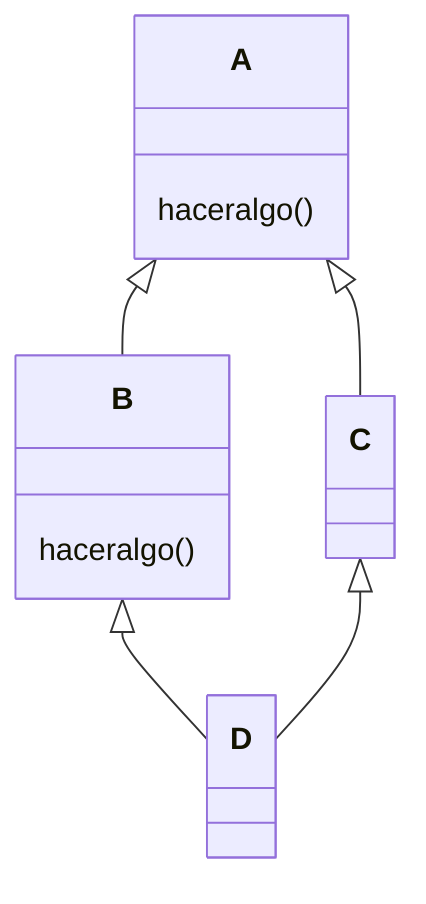

# 02/09

*Dato: Problema con herencia multiple.*

*Metodo polimorfico con mas de una implementación. ¿Cuál se ejecuta?*

# SmallTalk

*Falta contenido 26/08…*

- Todo es un objeto.
- Todo objeto es instancia de una clase.
- Toda clase tiene una superclase.
- Todo sucede mediante el envío de mensajes.
- La búsqueda de un método sigue la jerarquía de herencia.

## Literales

Se escriben en texto plano, y el lenguaje los convierte al tipo de objeto que corresponda.

## Variables

**Def:** Objetos puntero a otros objetos.

### Variables Pool

Diccionarios compartidos entre varias clases.

### Pseudovariables

**nil:** Es instancia de una clase “UndefinedObject”. Es usado para representar objetos no inicializados.

**true/false:** Son instancias de la clase True/False, respectivamente, que a su vez son subclases de la clase Boolean.

**self/super:** Es usada en metodos. Su valor es el **objeto que recibe el mensaje** que causa que el metodo que contiene self sea ejecutado.

**Diferencia!** Estrategia de busqueda utilizada por SmallTalk para encontrar el metodo con el cual responder el mensaje.

***self:** Comienza en la clase de la cual es instancia el receptor.*

***super:** Comienza en la superclase inmediata superior de la clase que contiene el método en el cual super aparece*

## Precedencia

En SMALLTALK la relación de precedencia en la evaluación de expresiones es la siguiente:

1. expresiones entre paréntesis.
2. expresiones unarias (evaluadas de izquierda a derecha).
3. expresiones binarias (evaluadas de izquierda a derecha).
4. expresiones de palabra clave.
5. expresiones de asignación.

## Expresiones de mensaje

En expresiones de mensajes complejas, el valor retornado es el retornado por el ultimo mensaje evaluado.