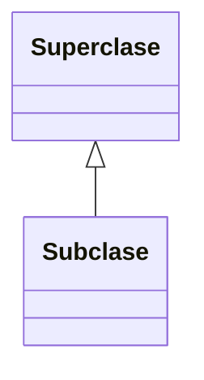
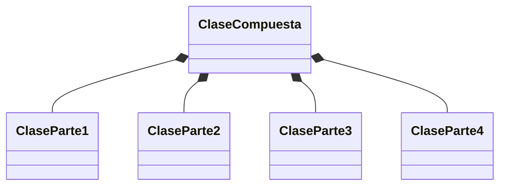
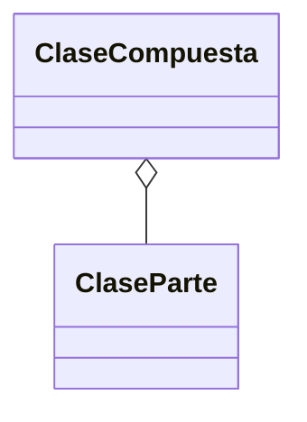
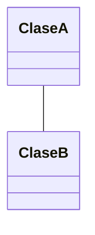

# 23/08

## Estado (de un objeto)

**Def:** Comprende todas las propiedades estaticas del objeto, más sus valores actuales (usualmente dinamicos) de cada una de esas propiedades.

- Es un buena practica encapsular el estado de un objeto.
- Es recomendado ocultar la representación del estado de un objeto a sus clientes externos. Ningun objeto puede modificar la representación interna de otro objeto.
- **Ningun objeto puede modificar el estado de otro objeto.**

## Comportamiento (de un objeto)

Expresa de que forma el objeto actua y reacciona en terminos de su cambio de estado y solicitud de servicio.

Los **metodos** asociados a un objeto implementan el comportamiento del objeto.

**Rol:** Es una mascara que usa el objeto y define un contrato entre una abstracción y sus clientes.

*Caracteristica:* Es la propiedad que es publica para los otros objetos.

## Identidad (de un objeto)

**Def:** Es aquella propiedad del objeto que lo distingue de otros.

La identidad de un objeto es preservada durante el ciclo de vida del objeto, aun cuando su estado cambie. El lenguaje proveera un mecanismo para asegurar esto.

*Dato: Algunos lenguajes de programación implementan esta propiedad como la direccion de memoria donde esta ubicado el objeto. Esto no es un requerimiento, el lenguaje podria funcionar bien aunque el objeto se mueva por la memoria, sin que cambie su identidad.*

## ¿Como identificar objetos?

Cosas tangibles/intangibles, roles, organizaciones, incidentes, interacciones, lugares, etc.

Generalmente sustantivos que aparecen en el dominio.

## Mensajes

Todas las acciones en POO resultan de envios de mensajes entre objetos.

Un mensaje es una solicitud para que un objeto ejecute una accion. Este objeto responde ejecutando un metodo, es decir, usando sus propios procedimientos.

En un mensaje interactúan un (objeto) emisor y un (objeto) receptor.

**Importante!** Mensaje y método son conceptos distintos. Dos objetos pueden responder a un mismo mensaje mediante distintos métodos. **Ej:** Un objeto *Rectangulo* y un objeto *Circunferencia* responden al mensaje *calcularArea* con dos métodos distintos. Relacionado con ***Polimorfismo**.*

La **interface publica** es el **protocolo** o conjunto de mensajes a los que puede responder el objeto. Es el punto de vista del usuario.

La representación privada son:

- Los datos necesarios para describir el estado
- La implementación de los metodos o procedimientos.

Es el punto de vista del programador.

El envio de mensajes soporta el principio de abstraccion de datos: El estado interno de un objeto solo puede modificarse mediante el envio de algun mensaje valido. Puede modificarse la implementación de un objeto sin que varie el comportamiento del mismo y por consiguiente, el programa que lo contiene (asumo que siempre y cuando las salidas sean las mismas)

## Resolución de problemas en POO

- Identificar los objetos del problema
- Identificar los mensajes a los cuales los objetos deberan responder.
- Definir la representación interna del objeto (menos importante?)
- Establecer una secuencia de mensajes a los objetos.

***Ejemplo:** Resolución de la suma de dos numeros.*

**Objetos:**

x,y,z de tipo “Numero”

**Mensajes:**

asignarValor, sumar, imprimirValor

**Secuencia de mensajes:**

- z.asignarValor(x.sumar(y))
- z.imprimirValor

# Programación Orientada a Objetos

**Def:** Programación que se implementa a traves del envío de mensajes entre objetos.

## Abstraer conceptos en POO

Dos conceptos principales

- Clasificación.
    
    Naturalmente, muchos objetos tendrán caracteristicas semejantes ⇒ Deberán ser agrupados de alguna forma ⇒ **Clase**
    
- Generalización/Especialización.

## Clase

**Def:** Conjunto de objetos que comparten estructura y comportamiento.

Contiene la descripción de las caracteristicas comunes de todos los objetos que pertenecen a ella:

- La especificacion de su **comportamiento**
- La definicion de la **estructura interna**
- La implementación de los **metodos**

Es un “molde”, una plantilla que define las propiedades y metodos que son comunes para los objetos de un cierto tipo.

*Concepto de “tipo de dato” dentro del marco del paradigma orientado a objetos.*

*Dato: En la teoría, una clase ya no es un objeto, pero en SmallTalk las clases son a su vez objetos (de una “meta-clase”?)*

A nivel de implementación: Contiene los atributos y la implemetación de los metodos.

## Relacion entre clases y objetos

Un objeto se dice instancia de una clase cuando sus métodos y atributos están definidos en la misma.

Una instancia es un individuo de la clase.

*Desde ahora se considera a instancia como sinónimo de objeto.*

| Clase | Instancias |
| --- | --- |
| Define atributos (propiedades estáticas) | Tiene valores (los almacenados localmente, son dinamicos) |
| Define métodos | Ejecuta métodos |
| Puede generar instancias |  |

## Caracteristicas de una instancia (objeto en el contexto de una clase)

- **Atributos** (dato privado)**:** Son variables para las cuales el objeto tiene un valor asociado. Estos atributos pueden ser:
    - Nombrados: La instancia accede a ellos por su nombre.
    - Indexados: La instancia accede a ellos utilizando un indice.
    
    (esto ultimo es una caracteristica del lenguaje SmallTalk)
    
- **Acceso a metodos:** Todos los objetos que son instancias de una clase dada acceden a los mismos metodos, por lo tanto, responderan al mismo conjunto de mensajes.

*¿Donde se definen los mensajes?*

## Relaciones entre clases

| Generalización | Composición | Asociación |
| --- | --- | --- |

## Generalización/Especificación

Proceso de modificación de un concepto generico para un uso especifico.

Es la noción que una clase de objetos es un caso especial de otra.

Un conjunto de clases tendrá caractersiticas generales (que pertenecen a mas de una clase) y caracteristicas particulares (que pertenecen a alguna clase) ⇒ Deberán estar organizadas en una estructura jerarquica ⇒ El metodo que brinda el POO es la **Herencia.**

## Herencia

- Concepto usado para definir objetos que son “casi como” otros ya existentes, con algunos cambios.
- Una clase **C** definida como heredera de una clase **A** tiene todas las características de **A**, a las que puede agregar propias.
- Herencia es la capacidad de **C** de acceder a los componentes (propiedades estáticas y métodos) de otra clase mas general **A** (de nivel superior en la jerarquía) considerándolos como propios, pudiendo incluso redefinir metodos.

**Superclase:** Clase de la que dependen otras clases en la jerarquía.

**Subclase:** Clase que está subordinada a otra clase en la jerarquía.

> **Regla de herencia es-un**
> 
> 
> No hacer que una clase B sea subclase de A a menos que cada instancia de B pueda ser vista como una instancia de A. *Un objeto B es, a la vez, un objeto A.*
> 

Una subclase puede redefinir metodos por dos motivos:

- **Reemplazo:** Se sustituye completamente la implemetación del metodo heredado manteniendo la semantica.
- **Refinamiento:** Se añade una nueva funcionalidad al metodo heredado.

### Tipos de herencia

- **Herencia simple:** Una clase es definida en terminos de una sola superclase inmediatamente superior. Ej: SmallTalk.
- **Herencia multiple:** Una clase hereda de dos o mas clases, que no estan relacionadas como una superclase y una subclase una de otra. No es tan utilizada. Ej: C++.
    
    **Problemas**
    
    - Las superclases pueden definir metodos para el mismo mensaje ¿Cual se activa?
    - Las superclases heredan de una superclase común. *Falta ejemplo.*
    
    Cada lenguaje resuelve estos problemas de maneras distintas.
    

### Clases abstractas y concretas

**Clase abstracta**

- No posee instancias.
- Sus subclases incorporan estructura y comportamiento.
- Admite implementacion parcial de algunos metodos.
- También pueden tener atributos.

**Clase concreta**

- Clase mas especializada.
- Poseen instancias.

*Es una buena practica que una clase sea o bien abstracta o bien concreta.*

**Métodos abstractos:** Métodos en clases abstractas, definidos en función del modelado para indicar que el método es redefinido en cada una de las subclases. No posee una implementación.

## Polimorfismo

**Def:** En el contexto de POO, capacidad de las diferentes clases de objetos para responder al mismo protocolo.

Habilita al programador tratar uniformemente objetos que provienen de clases diferentes.

Permite enviar el mismo mensaje a objetos diferentes, y que cada uno responda acorde al tipo de objeto que sea, ejecutando metodos distintos. Tampoco está restringido por la herencia, dichos objetos pueden ser instancias de clases no relacionadas entre si.

El polimorfismo esta asociado a la ligadura dinámica (*”dynamic binding”*). La asociación de un método con el mensaje que lo ‘’llama” no se determina hasta tiempo de ejecución.

El polimorfismo se extiende hacia abajo en la red de herencia porque las subclases heredan los protocolos, pero los metodos pueden estar especializados localmente (sin embargo, si no se redefine el metodo no hay polimorfismo). 

## Composición (objeto compuesto)

**Def:** Es un objeto compuesto por otros objetos interconectados por la relacion ***parte-de*** que son instanciados juntos. Es una extension recursiva de la nocion de objetos.

- Un objeto compuesto esta especificado por una clase que contiene la descripción que indica las clases de las partes y las interconexiones.
- El proceso de instanciacion crea las instancias correspondientes a todas las partes de la descripción.
- El proceso de instanciacion es recursivo, por lo tanto, un objeto compuesto puede ser usado a su vez como componente.
- En el contexto de una relacion de herencia, es posible especializar una descripcion por la adicion de nuevas partes o substitucion de partes existentes.

### Agregación

**Def:** La agregación es un tipo de composición, más débil, en la que el ciclo de vida de la clase parte no depende del ciclo de vida de la clase compuesta, es decir, tiene sentido que la primera puede existir separadamente de la otra (en la composición propiamente dicha, pasa lo contrario). Sin embargo una clase parte se relaciona solo con una clase compuesta a la vez.

## Asociación

Asociación entre clases más simple. Una clase **A** “conoce” a otra clase **B**.

