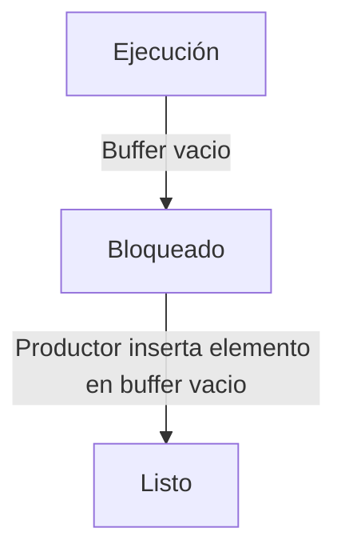
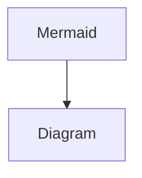

# IPC - pt. I

En linux, todos los dispositivos de I/O son archivos, ubicados en el directorio /dev/

Cuando se ejecuta un proceso, se abren tres archivos: **stdin**, **stdout**, **stderr**

### Pipe

```c
<comando1> | <comando2> | ... | <comandoN>
```

La salida de **comando1** será la entrada de **comando2**, cuya salida sera a su vez la entrada de **comando3**, y asi…

Estos comandos son procesos, los procesos se estan **comunicando**.

### En DOS

### En UNIX

Pipe: Buffer creada por el SO para almacenar aquello que va produciendo el proceso comando1, y comando2 lo va tomando del mismo lugar. Una vez que se lee un conjunto de datos de este buffer, se borra.


Se crea un pipe por cada simbolo ‘|’ (también pueden crearse entre procesos que no sean creados por el Shell, estos pipes tienen un nombre)

La estructura de Pipe esta en memoria, y es administrada por el sistema operativo.

Estos procesos se ejecutan concurrentemente ¿Como se planifican si algunos de ellos esperan datos de otros?

grep en EJEC: No puede ejecutarse, debe esperar un evento (que haya datos en el pipe). Pasa a BLOQ

cat en EJEC: Se ejecuta y deposita datos en el pipe.

Ahora grep puede ejecutarse.

¿Que pasaría si cat agota el espacio de la tubería? Debe esperar un evento: Que grep consuma datos del pipe. Pasa a BLOQ.

### Comunicación/Sincronización

- Comunicación: Permite ejecución de un proceso para influenciar ejecución de otro. Está basada en el uso de variables compartidas o envío de mensajes.
- Sincronización: Es necesaria frecuentemente cuando los procesos se comunican. Puede verse como un conjunto de restricciones para el ordenamiento de eventos.

## Condiciones de competencia

Los procesos Concurrentes (o threads) necesitan frecuentemente compartir datos y recursos, si no comparten datos de manera controlada puede obtener una vista inconsistente de los mismos. El resultado obtenido dependerá entonces del orden de ejecución. Esto no es admisible.

A estas situaciones se las denomina **Condiciones de Competencia** o Concurso (**Race Conditions**)


Un ejemplo de Spooling


Problemas que pueden surgir de compartir la variable “in”

## Regiones criticas

En el punto de la ejecución de un proceso donde se manipula datos o recursos compartidos, se dice que ese proceso se encuentra en una Región Critica (para ese dato compartido).

- La ejecución de una RC debe ser mutuamente exclusiva en cualquier momento (serializada).
- Solo debería permitírsele a un proceso por vez estar ejecutando la RC.
- Los procesos deben pedir permiso para ingresar en la RC.

Quien detecta que una región del código es critica es tarea del programador, no del SO. Por lo tanto, la petición de permiso para entrar a la región critica **se escribe explícitamente en el código**, así como una porción de código que “avise” que el proceso sale de la RC.

## Características de la solución

No pueden hacerse estimaciones respecto a la velocidad relativa de los procesos.

No puede hacerse ninguna suposición respecto al orden relativo de ejecución. Esas decisiones están a cargo del planificador de corto plazo.

- **Exclusión Mutua:** En cualquier momento, a lo sumo un proceso puede estar en la RC
- **Progreso:** Ningún proceso fuera de la RC debe impedir que otro proceso ingrese en la RC
- **Espera acotada:** Después que un proceso ha requerido ingresar en la RC, debe acotarse el número de veces que otro proceso pueda ingresar a la RC o el proceso en cuestión sufrirá de inanición.

## Tipos de soluciones

- Soluciones de software: Algoritmos que no se basan en soluciones del SO/HW/Lenguaje.
- Soluciones de hardware: Recaen en instrucciones especiales de máquina.
- Soluciones del SO: Provee primitivas al programador (system calls)
- Soluciones del compilador/lenguaje: Provee primitivas al programador utilizando las soluciones de HW, SW o SO.

A veces una solución de un tipo hace uso de una solución de otro. Ej: El compilador traduce una solución en otra que hace uso de servicios del SO, que a su vez hace uso de instrucciones de máquina.

## Con espera ocupada

El proceso, mientras se esta ejecutando y usando ciclos de CPU, se queda esperando a que se libere la RC.

Aparece cuando se tienen que usar soluciones de HW, porque el bloqueo es un concepto del SO.

### Variable cerrojo

**Clasif:** de Software.

```c
while(true)
{
	while(lock == 1)
		/*loop*/
	lock = 1;
	critical_region();
	lock = 0;
	non_critical_region();
}
```

Pero la variable “lock” es también un recurso compartido, por lo que esta sujeta a los mismos problemas que los otros recursos que buscamos salvaguardar con esta solución.

En realidad, no es una solución.

### Alternancia estricta

Clasif.: de Software


Si hubiera mas procesos, turn toma más valores.

De cualquier manera, no cuenta como solución porque no cumple con la característica de **progreso.** El proceso (b) puede darle el turno a (a) y (a) puede no estar en la región critica, pero de cualquier manera impedir que otro proceso entre a la RC.

### Desactivación de interrupciones

**Clasif.:** de Hardware

Si está en RC, otros procesos ni siquiera pueden ejecutarse porque el SO no puede planificarlos.

En uniprocesadores se preserva la exclusión mutua pero se degrada la eficiencia. No sirve en multiprocesadores porque en otra CPU las interrupciones no están desactivadas y el SO puede planificar.

Obviamente si el periodo de desactivación es muy largo se pierden pedidos de atención de controladoras.

No es una primitiva para dar a cualquier proceso: La instrucción de bloqueo de interrupciones no puede ser utilizada por procesos de usuario, solo por procesos del kernel.

### TSL

**Clasif.:** de Hardware

Es una instrucción de hardware (ejecutable en modo usuario). Copia el valor de una flag a un reg. de la CPU, y el valor de esa flag pasa a ser 1. Al ser una instrucción, se ejecuta de principio a fin sin “cortarse por la mitad”.

```c
TSL(Reg,Flag){
	lock_bus();
	disable_interrupts();
	Reg = Flag;
	Flag = 1;
	enable_interrupts();
	unlock_bus();
}
```

No es una solución en si, pero puede utilizarse para implementar la variable cerrojo:

```nasm
enter_region:
	tsl register,lock "Copiar el candado al registro y setear el lock a 1 (cerrado)"
	cmp register,#0 "Estaba el lock en 0 (abierto)?"
	jne enter_region "Si el lock estaba en 1, loopear"
	ret "return, se entra a la RC"

leave_region:
	move lock,#0 "Guardar un 0 en el lock (osea, abrirlo)"
	ret "return"
```

- Se preserva la exclusión mutua.
- Como problema, sigue siendo de espera ocupada
- Está fuera de uso. Como alternativa los procesadores Intel ofrecen xchg(a,b) que permite intercambiar el contenido de a y b.
    
    ```nasm
    xchg(A,B):
    	T = A
    	A = B
    	B = T
    
    Process Pi:
    repeat
    	k:=1
    	repeat 
      		LOCK xchg(k,b)
    	until k=0;
    	critical section
    	b:=0;
    	remainder section
    forever
    ```
    

### Solución de Peterson

**Clasif.:** de Software

```c
#define FALSE 0
#define TRUE 1
#define N 2

int wait; //Quién está esperando?
int interested[N] //Procesos interesados en entrar a la RC.
/*
	interested[i] inicialmente en 0, para todo i.
	Va a haber un 1 en interested[i] si:
	- El proceso i QUIERE entrar a la RC
	- El proceso ESTÁ en la RC
*/

void enter_region(int process){ //Asumiendo que process puede tomar solo 0 y 1, solo dos procesos.
	int other = 1-process; 
	interested[process] = TRUE;
	wait = process;
	while(wait==process && interested[other]==TRUE) /*El proceso debe esperar*/
}
/*
	Proceso A quiere entrar, entonces interested[A] es 1...
	- Si interested[B]=0 (osea no esta en la region ni esta interesado), entra.
	- Si interested[B]=1, A debe verificar que 'wait' no sea A para pasar.
*/

void leave_region(int process){
	interested[process] = FALSE;
}
```

***Problema mínimo:** Si A y B quieren entrar y justo antes de que A entre se pasa la CPU a B, A impide a B entrar a la RC sin estar ella misma en la RC (problema de progreso). Pero solo por un timeslice, entonces es admisible.*

### Problemas con espera ocupada

- **Problema de perdida de tiempo de CPU:** Procesos pasan su timeslice simplemente realizando una pregunta, y no “avanzando”.
- También, si planificador es apropiativo: Llega un proceso de mayor prioridad a estado listo → Se le quita la CPU al proceso que la esta usando, incluso sin que haya terminado su quantum.
    
    Surge el **problema de inversión de prioridades**:
    
    
    

## Con bloqueo

Un proceso que intenta ingresar a una RC que está ocupada, pasa de estar en EJEC a estar BLOQ (cuando se libere, el proceso pasará de BLOQ a LISTO).

### Problema del productor/consumidor

El problema es genérico, no es siempre un buffer. Pero para conceptualizarlo lo llamamos buffer, compartido entre productor y consumidor.

Productor: Proceso que genera items (caracteres/registros/etc.).

Consumidor: A su ritmo, toma elementos del buffer.





### Sleep/Wakeup

**Clasif.:** de SO.


Implementación de un productor


Implementación de un consumidor

**Problema!**

- Productor terminó quantum justo después de verificar que *count==N* es true.
- Consumidor, en su primera iteración ve que count estaba en N, entonces despierta al productor (que ya está despierto). Sigue consumiendo los items hasta que se queda sin ninguno y se bloquea.
- Lo primero que hace el productor al recuperar la CPU es hacer el bloqueo que tenía pendiente
- Ambos quedaron bloqueados indefinidamente

Es un problema demasiado grande, por ende se considera pseudosolución.

## Semáforos

**Clasif.:** del SO.

**Carac.:** Permiten realizar exclusión mutua y coordinar/sincronizar procesos.


Un semáforo es estructura, administrada por el SO, formada por:

- count: Una variable entera, accedida solo por dos operaciones (Syscalls) atómicas (no se “cortan a la mitad”) y mutuamente exclusivas.
    - **down(S)**:
        
        Disminuye el valor del count en 1. Si luego de eso count resulta ser negativo, el proceso se bloquea (o se mantiene bloqueado).
        
    - **up(S):**
        
        Aumenta el valor de count en 1. Si luego de eso count resulta ser positivo, un proceso se desbloquea.
        
    
    El count puede inicializarse también.
    
- queue: Una lista de procesos.

Los semáforos cuentan recursos. Cuando se hace un down(), hay un recurso que pasa a no estar disponible.

*Falta Mutex, leer en apunte ajeno.*

### Productor/Consumidor, con semáforos.

```c
#define N 100
semaphore mutex = 1, empty = N, full = 0;
//Semaforo = tipo de dato especial, la asignacion no sería exactamente así

void producer(){
	int item;
	while(1){
		produce_item(&item); //Generar algo para poner en el buffer
		down(&empty) //Decrementar el recurso "espacios vacios"
		down(&mutex) //Entrar a la region critica
		enter_item(item); //Poner el item en el buffer
		up(&mutex); //Salir de la region critica
		up(&full); //Incrementar el recurso "espacios llenos"
	}
}

void consumer(){
	int item;
	while(1){
		down(&full) //Decrementar el recurso "espacios llenos"
		down(&mutex) //Entrar a la region critica
		remove_item(item); //Sacar el item en el buffer
		up(&mutex); //Salir de la region critica
		up(&empty); //Incrementar el recurso "espacios vacios"
		consume_item(&item); //Hacer algo con el item
	}
}
```

### Problemas de los semaforos

- Los `up(S)` y `down(S)` dispersos en varios procesos hacen difícil determinar sus posibles defectos dificultando la detección de errores.
    
    Tener mucho cuidado con las operaciones que se realizan dentro de la region critica. **Nunca bloquearse dentro de una RC.**
    
- …

### Semáforos de eventos

- Esperan un evento externo, al llegar ese evento, los procesos avanzan.
- El `up()` (nombre puede cambiar) despierta a **todos** los procesos “dormidos” en el semaforo.
- No almacenan “desbloqueos” → No son contadores.

## Monitores

**Clasif.:** del Lenguaje

- Son construcciones de lenguajes de alto nivel que proveen una funcionalidad equivalente a la de los semáforos pero facilitando su control.
- Se encuentran en varios lenguajes que permiten la programación concurrente. Ej: Concurrent Pascal, Modula-3, uC++, Java.
- Generalmente implementados por semáforos.

### Definición

Es un modulo de software conteniendo:

- Uno o más procedimientos.
- Una secuencia de inicialización.
- Variables locales

### **Características**

- Variables locales solo accesibles por los procedimientos que se encuentran definidos dentro del monitor.
- Un proceso entra en el monitor invocando uno de estos procedimientos.
- Solo un proceso dentro del monitor a la vez **(garantiza exclusión mutua)**.
- Datos compartidos son protegidos ubicandolos dentro del monitor.
- Sincronización entre procesos mediante **variables de condición**: condiciones que el proceso necesita antes de ejecutarse dentro del monitor.
    
    ### Variables de condición
    
    Son variables locales al monitor.
    
    Solo puede accederse a ellas utilizando:
    
    - **`wait(a):`** Bloquea la ejecución del proceso que la invoca. Habilita el acceso al monitor. *Dato: Cualquier otro evento que bloquee el proceso que está dentro del monitor, no libera el monitor.*
    - **`signal(a):`** Continua la ejecución de un proceso bloqueado en la variable de condición.
        - Si existen varios procesos bloqueados solo despierta a uno.
        - Si no hay procesos bloqueados, no hace nada.
    
    
    
    Ejemplo de monitor, para el problema del productor y consumidor.
    
    
    
    Funciones de productor y consumidor.
    
    **Problema:** Pueden estar potencialmente el productor y el consumidor dentro del monitor.
    
    **Solución:** Ejecutar `signal(var)` como la ultima instrucción. *En Java, el proceso desbloqueado por el `signal(var)` no tiene acceso al monitor hasta que quien lo desbloqueó salga del monitor.*
    

## Contadores de eventos

Son variables especiales gestionadas por el sistema operativo.

Las operaciones sobre los CE son:

- `Read(E)`: Retorna valor actual de `E`.
- `Await(E,v)`: Bloquea al proceso llamador hasta que `E ≥ v`.
- `Advance(E)`:
    - Incrementa el valor de `E` en 1.
    - Verifica si hay procesos bloqueados en `Await()` donde ya no se cumple la condición de bloqueo.

## Barreras

**Clasif.:** de SO.

**Objetivo:** Sincronizar procesos.

Se implementa con semáforos.

**Pasos:**

- Esperar que lleguen N procesos.
- Cuando llegan N procesos, todos pueden avanzar.