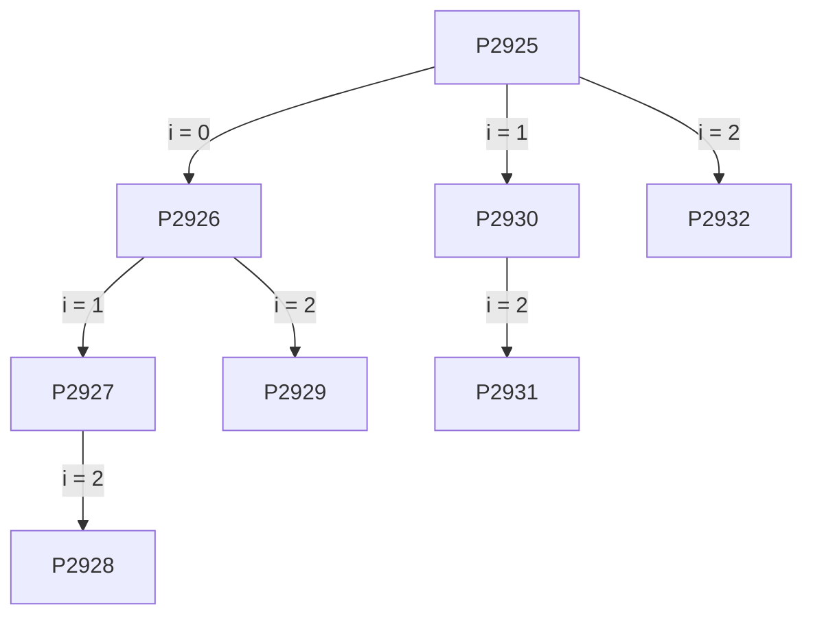

# 22/09

Repaso: Uso de la CPU va a ir rotando entre procesos. Planificador a corto plazo. Virtualiza en el sentido de que desde

### Proceso: Concepto

- Abstracción de un programa en ejecución
- (old) Entidad mínima planificable.
- (new) Entidad mínima de asignación de recursos.

### Otras denominaciones

- Proceso (denominación genérica)
- Job/Trabajo: Sinónimo de proceso, asociado a procesos tipo BATCH.
- Task/Tarea: Sinónimo de proceso, asociado a procesos del sistema, o procesos en tiempo real.

### Diagrama de estados

**Ready:** Proceso quiere usar la CPU pero no se la asignan.

**Waiting:** Bloqueado (no puede utilizar CPU) debido a esperar un evento externo. (Ej: Esperando E/S, esperando que otro proceso haga algo)

**New:** Al iniciar un proceso, el SO debe preparar un conj. de estructuras. 

**Terminated:** Estado previo a desaparecer (generación de estadisticas, etc.)

**Dato:** pip no se recicla en una misma ejecución del Sistema Operativo.

### Eventos que causan un cambio de estado

**LISTO ⇒ EJECUCION**

- El despachador selecciona al proceso para ejecución

**EJECUCION ⇒ LISTO**

- El proceso ha ejecutado demasiado tiempo, se le ha vencido el TimeSlice
- El proceso fue interrumpido y otro proceso de mayor prioridad ha quedado en estado LISTO (Desalojo/Preemptive)

**EJECUCION ⇒ BLOQUEADO**

- El proceso requiere algo que necesita esperar
- Quiere acceder a un recurso de E/S
- Debe esperar por el resultado de una comunicación

**BLOQUEADO ⇒ LISTO**

- Cuando el evento que estaba esperando que ocurra ha ocurrido.

**No se puede pasar de Ready a Waiting:** Uno debería ejecutar una instrucción que implique quedar en espera de un evento. Si se esta en Ready no se hace nada por ende no puede quedar en Waiting.

### Conformación de un proceso

- **Process Control Block (PCB):** Es creada y administrada por el SO. Son atributos que necesita el SO para controlar el proceso. Incluye:
    - Información de identificación
    - Estado del procesador.
    - Información de control.
    
    PCB es una estructura de datos. No están estandarizados los atributos (datos) que contiene el PCB, cada sistema guarda un conjunto de datos particular.
    

### **Cambio de contexto**

Def: Cuando un proceso deja de estar en ejecución para dar lugar a la ejecución de un nuevo proceso. Se deben realizar una serie de pasos:

1. Resguardar el PC y otros registros.
2. Actualizar el PCB del proceso en ejecución con su nuevo estado e información asociada.
3. Colocar la entrada del PCB en la cola apropiada.
4. Planificador selecciona el siguiente proceso a ejecutar
5. Actualizar la PCB del proceso nuevo.
6. Restaurar el contexto de CPU del proceso nuevo.

El cambio de proceso es costoso. Por ello, el timeslice se debe elegir estratégicamente para aprovechar eficientemente la CPU en avanzar el proceso y no en tareas administrativas (Poco timeslice: CdC muy frecuente. Mucho timeslice: Procesos tardan mucho tiempo en tomar la CPU)

### ¿Cuándo hacer el cambio?

Un cambio de contexto se debe hacer cuando el OS ha obtenido el control de la CPU

**System Call/Trap:** Explícitamente el  proceso ha requerido un servicio del OS. Probablemente el proceso quede bloqueado

**Excepción/Fallo:** Se ha producido un error al ejecutar la última instrucción.

**Interrupción:** Un evento externo ha causado una interrupción. El control se ha trasferido a la ISR.

### Cambio de contexto vs. Cambio de modo

No siempre que haya un cambio de modo, causado por alguno de los eventos anteriores, va a haber un cambio de contexto. **Ej:** Hay una interrupción, el SO revisa si ha terminado el timeslice del proceso que se está ejecutando actualmente. Luego, el proceso actual sigue con normalidad.

***No confundir rutinas (ej: ISR) NO implica un cambio de proceso. A efectos prácticos es como si se ejecutara una función del proceso que se esta ejecutando. Además, el estado se resguarda en la pila del kernel, no en la PCB. Por ende, una interrupción no siempre implica un cambio de proceso.***

## Jerarquía de procesos

Procesos crean procesos. Estos procesos padre-hijo se relacionan de distinta manera que procesos que no están relacionados.

### Crear proceso ⇒ fork().

El proceso hijo creado es un clon del padre en ese instante de tiempo. Es una copia, por lo que tiene su propio pid, espacio de memoria, etc.

Comienza a ejecutarse desde la instrucción siguiente al fork().

Luego de hacer el fork(), se debe hacer otra llamada al sistema si se quiere reemplazar esta imagen del proceso hijo por la imagen de un programa a elección.

### Reemplazar proceso ⇒  **exec()**

Trae una serie de parámetros indicando la imagen del programa que realmente se quiere ejecutar.

*Preguntas para 22/09: ¿Quién es el padre? ¿Quién crea el proceso cuando se hace el fork()? ¿Por qué no crear el proceso desde cero?*

**fork()** retorna:

- Padre: El pid del hijo.
- Hijo: 0.

---

**Datos:**

- *Proceso huerfano: Proceso cuyo padre ha terminado la ejecución*
- *Proceso zombie: Proceso cuya terminación no ha sido correcta, por lo que sigue apareciendo como “vivo” pero no lo esta.*
- *El SO puede no poder crear procesos, ya que puede llegar a quedarse sin recursos para hacerlo (no hay espacio en la tabla de procesos, no hay pid’s. Solución: Reiniciar). En este caso, fork() retorna un n° negativo.*

# Threads

Como funcionan los procesos (hasta ahora): Sigue una secuencia de instrucciones, si hay una llamada a función se guarda en la pila: Dir. de la sig. instrucción, valor de las variables locales y parámetros.

Actualmente, ya no es así. SO modernos admiten más de un **hilo de ejecución.** Efectivamente hay dos secuencias que avanzan independientemente (Si hubiera dos CPUs, podrían hasta ejecutarse simultáneamente)

Después

Antes

**Aplicación:** Divide y Vencerás?

Se ejecutan por llamadas al sistema, un pedido explicito del proceso.

Así, el proceso deja de ser la unidad minima planificable. Ahora un proceso puede tener muchos threads, que se planifican separadamente. Sin embargo, la asignación de recursos son propios de los procesos, todos sus threads tienen acceso.

## Cambios en la implementación

### Pila

**Problema!**

1. Thread 1 (T1) llama imprimir()
2. Antes de que imprimir() retorne la llamada de T1, Thread 2 también llama imprimir()
3. Antes de que imprimir() retorne la llamada de T2, imprimir() quiere retornar la llamada de T1.
4. La dirección de próxima instrucción en el top de la pila es la próxima instr. de T2.

Se necesita una pila distinta para cada thread. No un texto, no datos.

### TCB

Se necesita implementar una CPU virtual para cada thread. De hecho, ahora existe la **TCB (Thread Control Block),** que es separado de la PCB. Ahora, para no tener datos redundantes, la PCB tiene los datos comunes a todos los threads (pid, usuario que ejecutó) y cada TCB almacena los propios de su thread (prioridad, estado, copias del PC y registros).

## Características

- Se ejecutan independiente y simultanea/concurrentemente.
- Comparten instrucciones de proceso y casi todos sus datos (los que no: variables locales y parámetros de función)
- Si un thread realiza un cambio en un dato de los datos compartidos este será percibido por los otros threads en el mismo proceso. Debido a este comportamiento, su ejecución puede afectar al proceso de forma sorprendente.

Son threads a nivel kernel porque el SO soporta threads. Pueden implementarse aun así el SO no lo soporte: Threads for librerias.

### Ventajas

Si hay multiples CPUs, la ventaja es evidente porque pueden ejecutarse muchos threads de un mismo proceso a la vez.

Que se bloquee un hilo (para por ej, I/O), no frena el proceso completamente sino solo ese hilo y el resto seguir avanzado.

---

**Datos:** 

- Thread de proceso ≠ Thread de hardware. En los examenes Thread = Thread de proceso.