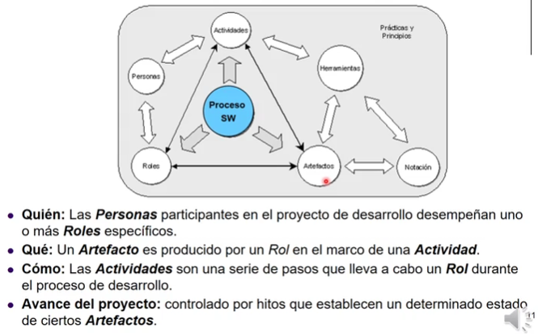

# Unidad 2: Procesos de desarrollo de Software

## Problematicas comunes en el desarrollo de SW

+ Problematicas causadas por la falta de procedimientos organizados...
+ Años 80s $\rarr$ Se crea el SEI, fundamentado en el hecho de que en un corto periodo de tiempo previo a ese momento, existieron experiencias fallidas en proyectos grandes de SW en EEUU. Objetivo: Realizar un trabajo mas organizado, sistematizado. Herramientas para lograr mejores resultados.
+ Hoy en día no se esta libre de fallas organizativas.

### Problematicas comunes

+ Incapacidad para estimar tiempo, costo y esfuerzo.
+ Falta de calidad (desde distintos aspectos) del producto.
+ Avance del hardware y requerimientos y aplicaciones más complejas.
  + Por operatividad con el nuevo HW y avances en los requerimientos que el cliente espera.
+ Cambio en la relación entre el costo de hardware y de software.
  + El HW es mucho mas accesible.

## CHAOS Report

Clasifica proyectos en:

+ Exitoso: El proyecto se completa en el tiempo y con el presupuesto planificado, con odas las funciones y caracteristicas espcificadas origianlmente.
+ Comprometido: El proyecto se completa y es operacional, pero con tiempos y presupuesto mayores a los estimados y/O con menor cantidad de caractersticas y funciones de las especificadas inicialmente.
+ Fallado o Cancelado: El proyecto se cancela antes de se completado o nunca es implmentado (o es implementado pero nunca utilizado, por cuestiones del cliente).

(Al menos, hasta 2015) Da estadisticas sobre el exito o fracaso de proyectos de SW. Tiene detractores que argumentan que trabaja solo con empresas grandes que tienen areas de desarrollo, y no empresas que se _dedican_ al desarrollo, y también que tiene requerimientos muy exigentes para que un proyecto se considere exitoso.

Actualmente es una herramienta para analizar _donde_ estan los problemas cuando falla (o se compromete) un proyecto.

1. Requerimentos incompletos: O incapacidad de gestionar con requerimientos cambiantes.
2. Pobre inclusión de los usuarios: Los usuarios no son involucrados/consultados. No son quienes validan los diferentes cambios.
   + Ej.: Sistema de ambulancias de Londres. Aunque quiza no haya fallado en otros aspectos, no se capacitó al usuario final del sistema y eso fue fatal.
3. Planificación y estrategia.

_etc..._

## Situación actual

+ Cambios enormes en HW: Por ejemplo las tecnologías moviles. Nuestros proyectos muchas veces van a tener la necesidad de ser adaptables a estas tecnologias.
+ También en SW: La gran variedad de tecnologias para construir distintos tipos de aplicaciones, pudiendo desplegarse mucho mas rapido que en el pasado, da lugar a mayores presiones para cumplir con plazos cortos.

Algunas cosas se mantienen igual...

+ El modelo en cascada, a pesar de sus falencias, sigue siendo utilizado por muchas empresas, a pesar de los  serios problemas.
+ Muchos procesos siguen pecando de mala estimación de tiempos, presupuestos, y sin entregar lo que quiere el cliente.
+ En muchas areas sigue sin existir un conjunto de estandares que se use ampliamente.

Son sintomas de una industria que todavía no es madura.

## Procesos, metodos y herramientas

Enfoque de calidad se materializa mediante definir procesos. Nos permite transitar las tareas de desarrollo de manera organizada y armoniosa obteniendo mejores resultados.

### Proceso

**Proceso:** Enfoque o marco de trabajo que puede aplicarse de manera sistematica, disciplinada y cuantificable en la aplicación de ingienieria de software.

Los procesos han de ser definidos independientes a proyectos de SW particulares. Despues el proceso se instancia en proyectos.

Un proceso define quien esta haciendo qué, cuándo y como lograr cierta meta.

### ¿Por qué definir procesos?

Si defino a la Ingeniera de Software como la aplicación de un **enfoque** sistematico, disciplinado y cuantificable al desarrollo, operación y mantenimiento del software... Ese enfoque del que nos habla es un **proceso**.

Nos dice que debemos trabajar utilizando procesos.

## El _proceso_ de desarrollo

Recordar que es solo uno de los procesos a definir si somos parte de una empresa de SW.

+ Organiza y estructura las actividades.
+ Contribuye a la calidad y la velocidad de desarrollo.
  + Al tener predefinidas las acciones, roles, el trabajo queda estandarizado...
+ Define el enfoque que se adopta mientras el SW está en desarrollo.

### ¿Que es?

+ Marco de trabajo compuesto por tareas a realizar para conseguir un SW de calidad.
+ Define un conjunto de actividades y resultados asociados que generan un producto de SW.

### ¿Es sinonimo de Ing. de Software?

El proceso define un enfoque para desarrollar SW de forma ingenieril, la Ing. de SW comprende ademas los métodos y las herramientas.

## El proceso de Software

Aquel proceso donde el producto que nos interesa es el software.

**Actividades estructurales** son aquellas como la comunicación con el cliente, la planificación, el modelado la construcción y el despliegue del SW.

¿Que no se esta haciendo al definir el proceso?

También existen **actividades de soporte** (umbrella activities). Son transversales a todas las actividades del marco de trabajo porque tienen que ver con la gestión, mas alla de las actividades tecnicas.

El concepto de proceso es importante porque integra actividades, roles, artefactos. Podemos visualizar estas relaciones...

## ¿Por qué seguir un proceso?

+ Brinda un conjunto de procedimientos organizados para construir productos que satisfacen ciertos objetivos/estandares.
+ Imponen consistencia y estructura a un conjunto de actividades.
+ Sabemos como hacer algo bien y forzar a que otros lo hagan de la misma forma.
+ En caso de que un proyecto no funciona, poder redefinir ese proceso identificando claramente lo que fallo y cambiandolo.

## Caracteristicas del proceso de SW

+ Estar bien definido y entendible.
+ Visible.
  + Documentado, formalizado...
+ Soporte.
  + De herramientas y metodos, definidos en el propio proceso.
+ Aceptado.
  + Utilizado por todos aquellos que tengan que trabajar con el.
+ Confiable.
  + Los errores dentro del proceso deben ser descubiertos antes de que se conviertan en errores del producto.
+ Mantenible/Adaptable.
  + Debe poder evolucionar para cumplir con cambiantes objetivos organizacionales.
+ Rapidez.
  + Debe colaborar en los tiempos que se manejan a nivel organización.

## Modelos de ciclo de vida

No es responsabilidad de la organización y no se define a nivel proceso, ya que esto puede variar de acuerdo a

+ La naturalieza del proyecto y aplicación.
+ Controles y entregas requeridas.
+ Caracteristicas del equipo u organización de desarrollo.
+ Restricciones de la empresa en la que trabajo.

Caracteristicas de los modelos de ciclo de vida...

+ Ayuda a establecer una secuencia u orden a las actividades estructurales.
+ Preescribir la forma de llevar a cabo el desarrollo, o descripciones de la forma en la que el desarrollo se lleva a cabo realmente (trabajar con una adaptación de un ciclo de vida a mi proyecto en particular)
+ Lo que todos tienen en comun, tienen como entrada los requerimientos del sistema y como salida el producto liberado al cliente.

## Estandares en ISW

Existen estandares para un sinfin de actividades, artefactos. De datos, de programación, planificación, estimación...

### ¿Por qué trabajar con estandares?

+ Definir estos procesos estableciendo un enfoque disciplinado y sistematico.
+ Facilita evaluar los procesos.
+ Mejorar la definición de procesos a mas corto plazo.

Objetivos:

+ Conseguir un marco para "hablar el mismo lenguaje" en el desarrollo y gestión de software.
+ Definir los procesos de desarrollo, mantenimiento y gestión del software, de forma genérica y abstracta.

---

Existen muchos institutos que generan estandares y certifican a las organizaciones en estos estandares.

Mucho tiempo coexistieron como estandares de procesos de ciclo de vida el **IEEE 1074** y el **ISO/IEC 12207**.

## Estandar ISO/IEC 12207

> "Un marco de referencia que contiene los procesos, las actividades y las tareas involucradas en el desarrollo, la explotación y el mantenimiento de un producto de SW, abaracando la vida del sistema desde la definición de los requisitos hasta la finalización de su uso."

+ Proporciona un marco de procesos para definir, controlar y mejorar los procesos de ciclo de vida del software.
  + No se refiere a las actividades estructurales que antes relacionabamos con el ciclo de vida, sino de procesos como concepto de mas alto nivel.
+ El conjunto de procesos que define el estandar sirven como un _marco_, esta diseñado para ser adaptado a cada organización y proyecto.

### Version 2017 (del estandar)

+ **Agreement processes _(Procesos de acuerdo)_**: Incluye adquisición y provision. Seran utilizados como cumplamos como equipo de desarrollo los roles de cliente y estamos teniendo que adquirir software, o vicecersa, cumpliendo el objetivo de proveer software a un tercero.
  + Se instancian independientes de un proyecto en particular.
+ **Organizational project-enabling processes _(Procesos que habilitan un proyecto organizacional)_**: Tienen que ver con la gestión de recursos de la organización.
  + Se instancian independientes de un proyecto en particular.
  + Aqui se encuentra el estandar para elegir un modelo de ciclo de vida segur los recursos con los metodos y herramientas con las que cuenta, junto con otras restricciones.
+ **Technical processes _(Procesos tecnicos)_**: Aquellos que ayudan a desarrollar, tecnicamente, un proyecto de software. Ej.: Requerimientos y necesidades de stakeholders, requerimientos de sistema, definición de diseño, definición de arquitectura, implementación, integración, verificación. 
+ **Technical management processes _(Procesos de gestión tecnica)_**: Ayudan a la planificación y evaluación de todo lo que tiene que ser estimado y controlado durante los procesos tecnicos. Ej.: Gestion de decisiones, riesgos, medición, aseguramiento de la calidad (de procesos y productos), planificación de proyectos.
  + Dan soporte a los procesos tecnicos.
  + Se instancian, junto a los procesos tecnicos, teniendo en cuenta un proyecto en particular.

### Aplicación de los procesos

Las funciones que desarrollan estos procesos estan definidas en terminos de propositos especificos...

## Proceso de IS en SWEBok

Se analiza en dos niveles:

+ Primer nivel: Desarrollo tecnico del producto. Gestión dentro del ciclo de vida del SW.
+ Segundo nivel: Un "meta-nivel". Se involucra la definición, implementación, evaluación, gestión, cambio y mejora del proceso de software. Definición formal del proceso, el control de esa definición en función de evaluar la aplicación del proceso en primer nivel.

Menciona que no es solo importante para grandes empresas, sino para equipos chicos o desarrollo individual, porque organiza la forma de trabajo.

Involucra considerar e integrar otras areas de conocimiento, no solo procesos tecnicos. Cuestiones economicas, gestión de inversiones, gestión de recursos humanos.

Incluye...

+ La definición del proceso.
+ La implementación y cambio del proceso.
+ La evaluación del proceso.
+ La medición del proceso y el producto.

Esto no es un orden, para poder evaluar un proceso primero hay que medirlo, y para cambiarlo primero hay que evaluarlo para ver si los cambios son necesarios.