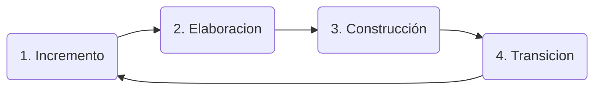

# Practica: Procesos

La metodología de desarrollo de software depende de tres factores:
+ Tecnología.
+ Tipo de organización (o sus procesos): No es lo mismo hacer SW para una org. gubernamental que start-up.
	+ Si es una empresa chica, con procesos poco estrictos (no hay que seguir una serie de pasos rigurosos, en pos de ir más rápido)...
+ Personas involucradas. Con respecto al nivel de experiencia.

## Framework Cynefin

"Cuatro lugares donde puedo estar en una organización, dominio de problema".

+ Simple (clear): El problema tiene una forma de solucionarse. Hay reglas estructuradas, hay mejores practicas. Puede no ser facil, pero hay una solución conocida.
	+ Casi nada de SW esta ahí. Se da en otros ámbitos de la ingeniería.
+ Complicado: Conozco el causa-efecto, pero no siempre una acción tiene el mismo efecto. Entonces, diferentes acciones para un mismo efecto. Hay formas sugeridas para resolver un problema, y analizar cual conviene. No hay mejores practicas, pero hay "sugerencias" más generales.
	+ Ej.: Controladores. Puede haber manera de codearlo pero el dominio no es "aleatorio".
+ Complejo: La mayoría del software esta acá. No se conoce el efecto de las acciones. Requerimientos poco estable, todo lo que conoces del dominio puede no ser así en un futuro. No hay mejores soluciones, ni sugerencias que valgan para todo.
+ Caótico: Momento de crisis. No hay metodología ni modelo de procesos. Accionar rápido.
+ Desorden: Falla de criterio sobre donde se está parado.  

### Sprint (en el framework Cynefin)

Útil para adaptarse a los cambios de dominios "complejos".

Hay dos reuniones:
+ Retro: Ver el "como". Como trabajo el equipo.
+ ...: Ver el "que". Cual es el estado del producto.

## Iterativo/Incremental

### Slicing

+ Por funcionalidad: No es incremental. Hasta que no tenes todas las piezas el producto no es usable.
+ : Las piezas no solo te acercan al endgame, pero son útiles *hoy*.
---
**"MVP"**: Minimum Viable Product. Un producto de software que es usable, da valor al usuario. Mínimo es importante para que de valor lo más rápido posible.

Iterativo/Incremental trabaja con slicing que genere MVPs.

¿Cuánta documentación se genera? Un proyecto con requerimientos estrictos de documentación es complicado con I/I (hay que ajustarla cada vez que hay cambios)
 
---

### Cuando I/I  

+ Accionar ante malentendidos.
+ Accionar ante cambios de requerimientos.
+ Generar valor más rápido.
+ Se puede paralelizar.
	+ Cuidar la integración de las partes.

### Cuando *no* I/I

+ Si los incrementos o slices son muy grandes, se transforma en un Waterfall.
	+ Pero no por mala organización. Porque por ejemplo, el SW solo sirve si esta completo (o en su gran mayoría).
+ El cliente tiene poca visión de lo que quiere.
+ Los requerimientos son estáticos, y están muy claros. No hay porque gastar tiempo en las validaciones entre incrementos.

## RUP

Cumple con el marco de trabajo de I/I, **pero** es más estricto en documentación, cada iteración tiene un proceso definido, con entregables definidos.

**Salidas:**

1. .
2. .
3. Construcción: Sale código.
4. Transición: Sale código funcionando.

### Ejemplo de Rationale para usar RUP

Una ONG, visión de ayuda a economías de Santa Fe, con aportes gubernamentales. Banco Iberoamericano pone (mucha) plata y quiere visibilidad sobre lo que estas haciendo con la plata, y como va el proyecto todo el tiempo. Equipo experimentado, académico. Tecnología solida. Dominio muy conocido, probado. Tiene que estar bien documentado ya que el modelo se tiene que replicar en otros lugares.

### Ventajas RUP

+ Modelo replicable. La documentación genera una rampa de aprendizaje para personas nuevas que se sumen.

### Desventajas RUP

+ Tiempo y plata que cuesta documentar.

## Prototipado evolutivo

La diferencia esta en el prototipo. Hay una idea o hipótesis que hay que validar, no se sabe lo que se quiere, si es lo que el usuario quiere, si se va poder vender.

Algo más barato que un MVP. Algo mínimo y viable pero que no sirve como producto. Un prototipo se tira. El valor es tener feedback, si es lo que se necesita, si anda, si alguien lo compraría.

Es más costoso que lo incremental. Porque el trabajo se tira.

Si todo se tira, ¿Cómo se evoluciona?

+ El primer prototipo si se tira entero.
+ Las ideas que se validan, se pueden construir de manera iterativa para que quede. A esta se le suma otro prototipo para validar otra cosa, etc...
+ Así, en cada incremento hay un componente desechable, el prototipo.

Depende la tecnología, es más o menos rápido.

|Ventajas|Desventajas|
|-|-|
|Dominio desconocido. Sin claridad sobre los requerimientos o de si va a funcionar | Mucho tiempo/plata en los prototipos descartables|

En empresas grandes no hay prototipos, porque la diferencia de costo no hace la diferencia.