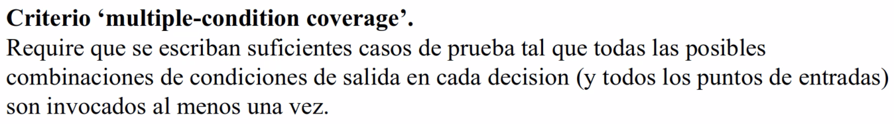

# Validación y Verificación

> Escribir software como si fueramos los unicos que van a verlo es una de las mayores misconcepciones.

---

Dentro del ISO/IEC 12207, veremos

Proceso de gestión técnica: Proceso de aseguramiento de la calidad.

+ Ayudar a la aplicación efectiva de los procesos de gestión de calidad de la organización al proyecto.
+ Proveer confianza que los requerimientos de calidad serán alcanzados. Calidad deseada y politicas y procedimientos de la organización y proyectos son seguidas.
  + "Calidad": Que el sistema genere resultados esperados.

## Fallas del software

Tres terminos claves: Error, defecto y falla.

Error: Lo que normalmente la persona que trabaja en el proceso de desarrollo, produce. Accion equivocada -> genera un error.

Si no es detectado cuando es generado -> Genera un defecto

Defecto: Consecuencia de un error que se mantiene por un tiempo prolongado, en un estado latente (falla potencial).

Falla: Cuando el defecto se visualiza _por el usuario final_.

Que pasa si visualizo ese defecto cuando estoy en desarrollo? Es falla? No se considera como tal, estrictamente.

Objetivos:

+ Detectar errores.
+ .
+ Minimizar fallas.

### Falla

+ Incapacidad del sistema de hacer lo que se espera de él. Pantallas azules, freezes.
+ Un poco más sutil. Desviación. El sistema responde, muestra resultados, pero los valores que genera no estan dentro de los esperados.

Razones:

+ Esepcificaciones no estipulan exactamente lo que el cliente precisa o quiere.
+ Requerimientos (funcional o no) que no se pueden implementar.
  + Tecnología no disponible, presupuesto no disponible.
+ Defectos de diseño.
+ Defectos en el código.

Defectos de especificación son más caros que los de codigo...

## V&V

Proveer evidencia objetiva que un sistema o elementos de un sistema cumplen totalmente con sus requerimientos y características especificadas.

Verificación: Producto generado cumple con sus especificaciones y que ses igan los procesos definidos para su generación.

Validación: Proveer evidencia objetiva de que el Sistema, cuando es´ta en uso, cumple totalmente con sus objetivos de negocio, misión y requerimientos de los los interesados. Reitero: Es sobre el sistema que esta siendo utilizado. El sistema en tiempo de ejecución cumple con sus requerimientos. Quien valida el producto son los stakeholders o interesados.

También se pueden validar las especificaciones... Consideración especial: Requeriria que el usuario final no "vea" el trabajo hasta el momento donde esta finalizado. En definitiva, el sistema debe respetar las especificaciones, entonces porque no asegurar la correctitud de estas.

### Verificacion vs. Valdicacion

+ Verif.: "Se esta construyendo correctamente el producto?". Producto confirme a sus especificaciones, busca comprobar que el sistema cumple con los requerimientos especificados.
+ Validacion: "Se esta construyendo el producto correcto?"

### Objetivos de V&V

+ Asegurar que el sistema cumpla con las necesidades del usuario (uno de los interesados).
+ Descubrir defectos (para corregirlos), provocando fallas o revisando los productos.
+ Evaluar la "calidad" de los productos: Ver que los resultados sean esperados.

## Proceso V&V

+ Se dan durante todo el ciclo de vida. No solo en la etapa final del proceso de desarrollo como se piensa normalmente.

V&V Dinamica: Pruebas y provocación de fallas

Pruebas solo se pueden hacer sobre elementos en ejecución, ya sea sobre el sistema real o prototipos.

V&V Estatica: Revisiones. Se pueden realizar sobre cualquier elemento de software, aunque tenga una representación estatica: Especificacion de requerimientos, Arquitectura de SW, Modelos de diseño UML, Esquemas de base de datos, ademas del programa y el prototipo.

---

## Pruebas de SW

+ Objetivo.
  + Pruebas de validación: Demostrar al cliente y al desarrollador que el SW satisface sus requerimientos.
  + Pruebas de defectos: Descubrir defectos en el SW en su comportamiento incorrecto, no deseable o no cumple con sus especificaciones.

Es un proceso que intenta proporcionar confianza en el SW.

### Prueba de defectos

+ Es dínamica.
+ Puede probar la presencia de errores, no su ausencia. No encontrar errores no asegura su inexistencia.
+ Se considera exitosa si se descubren errores.
+ Los defectos se descubren examinando las salidas y buscando las anomalías.
+ Deben ser usada _en conjunto_ con la verificación estática.

### Proceso de Prueba

## Casos de Prueba

Pruebas exhaustivas son imposibles. Probar todos los valores posibles.

Def.: 

+ Especificación de una entrada para la prueba.
+ Una salida esperada del sistema, y...
+ Una afirmación de lo que se está probando.

Ejemplo:

La complicación es elegir los "mejores casos de prueba".

### Datos de prueba

+ Las entradas que han sido ideadas para probar el sistema.
+ Pueden generarse automaticamente.

Los casos de prueba, por el momento, no pueden generarse de forma automatica (con todos sus elementos).

La salida solo puede predecirse por "personas" que comprenden lo que debería hacer el sistema. Esto puede cambiar con la introducción de inteligencía artificial.

La elección del subconjunto de casos de pruebas debería basarse en políticas organizacionales (estandares internos) o métricas. Debo tener una referencia que me diga cuales y cuantos CdP realizar.

## Diseño de CdP

+ Efectivos descubriendo defectos, y
+ Muestren que el sistema satisface sus requerimientos.

### Proceso

1. Seleccionar una caracteristica del sistema o componente.
2. Seleccionar un conjunto de entradas que ejecutan dicha caracteristica.
3. Documentar las salidas esperadas o rango de salida.
4. Diseñar una prueba automatizada que pruebe que la salida...

### Enfoques

+ Pruebas basadas en requerimientos: Para cada requerimiento se define un conjunto de cdp. para ver si el sistema los satisface.
+ Prueba de particiones: Para grupos de datos que tienen caracteristicas comunes: Todos los numeros negativos, todos los nombres con 'x' caracteres, etc. Se elige un representante de esta particion, y potencialmente también probar en los "bordes" entre estas particiones.
+ Pruebas estructurales: Utilizando el conocimiento estructural del programa se diseñan casos que ejecuten todas las partes del programa. Probar "todos los caminos". Por ahi con codigo muy extenso no es posible.

Pruebas estructurales:

Cobertura logica: Probar todas las ramas de decisión.

Incluye a la opcion anterior.

Es el más exhaustivo.

## Proceso de SW y Pruebas

Cada "actividad" o etapa del proceso de desarrollo clasico tiene un tipo de pruebas asociado.

Ver de diapo.

### Fases de pruebas

+ Pruebas de componentes:
  + Pruebas de unidades: Prueba de componentes individuales.
  + Prueba de módulos: Prueba de conjuntos de componentes dependientes.
+ Pruebas...

## Estrategias de pruebas

+ "Nunca se termina de aplicar una prueba; la carga simplemente se desplaza de Ud. a su cliente."
+ Hay que definir criterios de finalización. Ej.: Cuando se agota el tiempo o el dinero.
+ Hacer pruebas es costoso, y lleva igual o más tiempo que el desarrollo.
+ Realidad:
  + No hay reglas cuantitativas para las pruebas.
  + Pero... Trabajar sobre métricas y modelos de confiabilidad de SW.

### Aspectos estrategicos

+ Especificar los requerimientos del producto de manera cuantificable mucho antes de que empiecen las pruebas. Debería ser verificable para que pueda constatarse si el sistema cumple o no. En requerimientos funcionales es más dificil, porque deberías incluir información adicional ya pensando en la prueba. Si es más comun en el requerimiento no funcional.
+ Organizo las pruebas en función de cuales son los usuarios del software y desarrollar un perfil para cada categoría de usuario.
+ Desarrollar un plan de pruebas que enfatice "ciclos de pruebas rapidos".
+ Diseñar un SW que facilite las pruebas.
  + A modo de ejemplo: Control de errores incorporado en el producto (excepciones en Java).
+ Usar revisiones técnicas formales y efectivas como filtro previo a la prueba.
+ Recordar que es un proceso más...

### Estrategias convencionales

+ Esperar a que el sistema este concluido en su totalidad. No recomendable.
+ Probar diariamente (muy efectivo).
+ Enfoque incremental.
  + Prueba de unidades invidicuales.
  + Prueba de integración de unidades.
  + Prueba sobre el sistema completo.

## Pruebas unitarias

### Def.

+ Verificacion de la unidad más pequeña del diseño de SW: Componente o módulo.
+ Se concentran en la lógica del procesamiento interno y las estructuras de los datos dentro de los limites del componente.

---

El concepto de unidad depende de la granularidad de lo que quiera poner bajo testing. Esto puede ser modulos, componentes, o incluso sistema (aunque no tendría mucho sentido)

### Que probar?

+ Prueba de la interfaz del modulo: Asegurar que la información fluye apropiadamente hacia dentro y hacia fuera de la unidad. No se sabe lo que pasa dentro, caja negra.
+ Prueba de estructura de datos locales: Asegurar que los datos temporales mantienen la integridad durante toda la ejecución. (???)
+ Prueba de caminos independientes: Asegurar que todas las instrucciones de un módulo se hayan ejecutado al menos una vez.
+ Prueba de condiciones limites: Asegurar que el modulo opera adecuadamente en los límites establecidos. Ej.: Llegar al n-esimo elemento de un array de n elementos.
+ Prueba de todos los caminos de manejo de errores. Apuntan a ver si el control de errores esta correctamente implementado, si lo está:
  + Descripciones de errores no comprensibles.
  + Identificación de error incorrecta.
  + La condición de error no es la capturada por la aplicación.
  + El procesamiento de la confición de error es incorrecta.
  + La descripción del error, no provee información suficiente para ubicar el error.

### Entronos de pruebas unitarias

Proveida por herramientas de unit testing

Driver: Alguien que me permita ejecutar mi unidad de prueba. Normalmente va a ser la herramienta que estoy usando para hacer pruebas unitarias.

Muchas veces, los modulos son dependientes de otros. Para eso necesito dobles de prueba (por ej.: si el modulo todavía no estuviera implementado).

+ dummy: Da lugar para que pueda hacer la llamada pero no devuelve nada.
+ stub: Devuelve valores constantes.
+ spy: Devuelve valores pero ademas hace un registro de las llamadas para tener mediciones de cuando se llama.
+ fake: Implementación compleja, con parte de la logica del modulo que se reemplaza pero con menos caracteristicas.
+ mock: Implementación dinamica. Necesitan de generadores de mock.

## Pruebas de integración

.