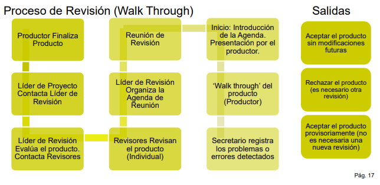
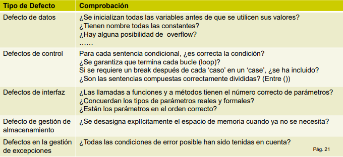
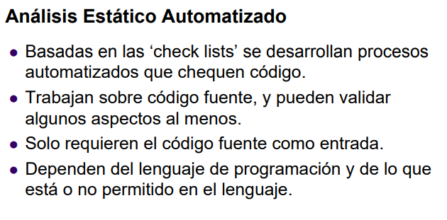
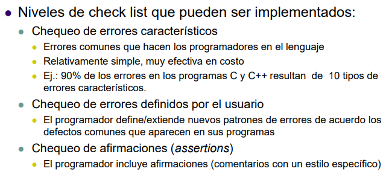

# Validacion & Verificacion (pt. 2)

## Revisiones

Se busca saber si el producto esta bien construido. Actividades de QA para chequear calidad de los entregables. "No sabemos si es util, pero sabemos que es correcto y de calidad".

Se examina:

+ El producto de SW.
+ Su documentación (especificaciones, diseño, planes de pruebas, manuales de usuario).
+ Procesos (procedimientos de GCS, estandar de procesos, estandar de programación).

(...)

## Inspección

Es sobre **codigo** en particular.

### Tecnicas

+ Inspecciones informales.
+ Inspecciones formales.
+ Analisis automatico del codigo fuente.

### Limitaciones

+ Solo puedo controlar si el programa concuerda con su especificación.
+ NO si cumple ultimamente con las necesidades del cliente. Osea, no sabe si es util.
+ No pueden analizar propiedades como rendimiento y fiabilidad.

## Costo de revisiones

Existen modelos. ¿Que pasa con el producto de SW, dado que en cada etapa de desarrollo se detecta una cantidad N de defectos?

En resumen: Encontrar defectos más temprano (revision más temprana) es más barato finalmente, incluso despues de contar la inversion que se hace en el mayor # de revisiones.

## Modelo de referencias para revisiones técnicas

Para hacer revisiones debo tener gente que cumpla diferentes roles: alguien que va a ser revisado y alguien que revisa.

Debe existir una planificación y preparación: Cuando, quienes, ...

Reuniones para realizar la reunion: Pueden ser informales (dos personas juntandose a revisar trabajo)

Correcciones y verificación.

### Formales e informales.

...

## Revisiones informales

### Formas

+ Checkeo de escritorio, con un colega.
  + No hay planificación (tengo un problema, vamos a verlo).
  + No hay agenda.
  + No hay seguimiento de los errores encontrados.
  + Su efectividad es considerablemente menor que una reunión más formal. *Pero igual sirve*.
+ Reunion casual (más de dos personas)
+ Programación de a pares (XP)

### Mejoras

+ Utilizar "checklists" de revisión: Preguntas genericas para guiar la revisión. Por ejemplo una UI:
  + ...

## Revisiones formales

La diferencia es el nivel de rigurosidad con el que se realiza cada activididad.

Objetivos:

+ Buscar errores en la función logica o implementación de cualquier representación del SW.
+ Verificar que el SW alcanza sus reqs.
+ Asegurar que el SW está representado de acuerdo a los estandares.
+ Obtener SW desarrollado de una manera uniforme.
+ Hacer los proyectos más manejables.

### Tipos

+ Walkthrough.
+ Inspecciones.

### Reunion de revisión

+ Entre 3 y 5 personas deben estar involucradas.
+ La preparación de la reunión no debe llevar más de dos horas de trabajo por perona involucrada.

### Roles

+ Autor o propietario: Programador o diseñador responsable del programa o documento. Respondable de reparar los defectos.
+ Inspector/revisor: Encuentra errores...
+ .
+ .

### Tipo de revisión: Walkthorugh

El productor va mostrandoles a los revisores y comentando cada linea del producto en revisión.

## Tips para revisiones

+ Un revisor puede enviar un informe escrito (pre).
+ Una reunion no debe superar las 2 hs.
+ El equipo es de un minimo de 3 a 5 personas.
+ El equipo de revision debe ser externo al proyecto.
+ Si es necesario, revisión post corrección

## Tipo de revisión: Inspecciones

+ Son 'revisiones de a pares'
+ Se revisa linea por linea el codigo fuente del programa.
  + O el modelo de diseño del programa.
+ Defectos tipicos:
  + Errores de lógica (algoritmo).
  + Anomalías en el código: Condiciones erroneas u omisiones.

### Lista de comprobación de errores

Un ejemplo...

## RTF utilizando GitLab

...

## Analisis estático automatizado

Algunas herramientas estan orientadas a seguridad. Revisan tu codigo por vulnerabilidades, paquetes que usas por vulnerabilidades...

## Relación con la gestión de configuración

Las RTF estan dentro del proceso formal de GCWS.

## Ventajas

Ventajas de las tecnicas de inspección sobre las pruebas:

+ Al no considerar la interacción entre los errores, se pueden descubrir varios errores en cada inspección.
+ Se puede inspeccionar versiones incompletas de un sistema sin costos adicionales.
+ Pueden considerarse atributos de calidad como cumplimiento con los estándares, portabilidad, facilidad de mantenimiento