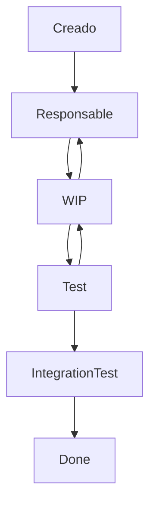

# Plan de Pruebas (cont.)

## Caso de pruebas

### Entradas

+ Componente a probar.
+ Datos de entrada.
+ Salidas esperadas

### Salidas

+ Resultado de la prueba. Salida esperada == Salida real??
+ Conexiones realizadas.

### Incidentes

Se pueden dar en dos momentos:

+ En producción: Va a tener asociada una prioridad, dependiendo de la criticidad del error.
+ En periodo de pruebas.

Son similares y comparten partes del ciclo de vida.

Tienen asociada una maquina de estados:

## Tipos de test

### Unit

+ Dependen de la tecnología.
+ Prueban componentes aislados.

### Integración

### Funcionales

+ Prueban los casos de uso (o bien modelados literalmente, o en forma de historia de usuario, ver el modelo de ciclo de vida...), literalmente las funcionalidades.
+ Existen herramientas para automatizar la prueba de  funcionalidades completas, desde la UI.
  
### De sistema

+ Rendimiento: No prueba la carga ni que se "caiga". Tiempo de respuesta, como varia en base al tamaño de entrada.
+ Estres: Buscar "romper" el sistema, ver cual es el maximo. De datos, de requests, depende de que sea el sistema...
  + Ej.: Requests https con un cliente REST.
  + Que se rompe antes, la API o la conexión a la BDD?
+ Usabilidad: Presentar a alguien (preferiblemente que no sea el target del SW) y que use el sistema.
  + Luego, presentarle una encuesta, que pueden ser preguntas de si/no o de nivel de "aceptación" (de 1 a 5 por ejemplo).
  + Se intenta basar en criterios objetivos: Cantidad de clicks para llegar a algun lado. En mobile, la cantidad de información que puedo ver sin scrollear.
  + Accesibilidad: Usabilidad teniendo en cuenta el userbase del sistema, y las necesidades especiales que pueden tener (si son adultos mayores, tamaño de letra por ejemplo).
+ Seguridad
  + Penetration Test (Pentest): Ciberataque simulado para encontrar vulnerabilidades.
  + Test DoS.
+ Concurrencia
+ De Carga: Probar que la carga de datos la soporta.
  + Plantea escenarios de test.
+ End to End: Similar a integración. Se prueban funcionalidades punta a punta. Son automatizables.

### Aceptación de Usuario (UAT)

+ El usuario no es necesariamente el usuario final. Si no el stakeholder o el sponsor de la iniciativa.
  + A la vez, el sponsor puede basarse en necesidades que detectó que tienen los usuarios finales.
+ Criterios de inicialización: Cuando hay un incremento de valor, cuando tengo algo para probar.
+ Criterio de aceptación: Las pautas que definen que el sistema sea aceptado por el usuario.
  + Aca entran la prioridad de las incidencias. Una propiedad muy importante de los mismos es la criticidad (la cantidad de "niveles" depende de la empresa).
  + Ej: No hay incidentes criticos y se resolvio cierto porcentaje de incidentes no criticos.
+ Criterios de finalización (cancelación): Criterio para terminar las pruebas abruptamente, y no volver a realizarlas. Puede ser:
  + Usuario tiene cierto presupuesto determinado a probar. Si se acaba el presupuesto no puede seguirse probando por lo que se cancelan las pruebas.
  + ...
+ Criterios de suspensión: Criterio para terminar las pruebas abruptamente, y eventualmente vovler a realizarlas. Ej.: Muchos errores, probamos despues.

### Regresión

+ Cuando hago un cambio, vuelvo a correr mi bateria de tests para checkear que los resultados sean los mismos (salvo que ese cambio justamente busque que el resultado de un test cambie, por ejemplo si un test estaba fallando)

### ¿Que tests se pueden hacer paralelamente?

Por ejemplo, no podes hacer tests de carga, estres a la vez que un UAT, porque va a afectar seguro a la experiencia del usuario.

Ejemplos de pruebas que si se pueden hacer paralelamente serian usabilidad y UAT.

Tests de seguridad depende cual, si me borra la BdD no por ejemplo. Es común que se hagan tests de seguridad *"seguros"* en sistemas en producción (podes predecir el resultado de, por ejemplo, una SQL injection, sin hacerlo).

## Gestión de Recursos Humanos

¿Quien se encarga de hacer cada test?

Los UT, los mismos desarrolladores de los componentes que se estan probando.

De integración, probablemente también los desarrolladores, o algun lider técnico.

En git se puede ejecutar una bateria de tests junto con los pull requests. Ejecutar UT, Integración, Seguridad (tests de codigo estatico, condiciones de carrera).

Métricas de cobertura de codigo. Metricas de caso de prueba que te permiten o no permiten mergear.

Herramientas de integración continua para este tipo de cosas: Jenkins.

Funcionales, o los desarrolladores o el equipo de QA, o el product owner en SCRUM.

Sistema, area de infraestructura, area de seguridad. En MercadoLibre los tests estan descentralizados, hay herramientas para que los desarrolladores puedan hacer muchos tests distintos sin necesidad de conocer tanto sobre el tema. A lo sumo pedir ayuda cuando el test es más complejo.

UAT, el usuario (o un representante) junto a un responsable del producto

Regresión, depende.

---

### Algunas buenas practicas

+ Pensar en la seguridad ya desde el modelado. Ej.: Thread modeling. Test Driven Development.
  + Existen herramientas AI-powered para TDD, en la que entregas los casos de uso y te genera los casos de prueba.
  + En la practica no es tan facil aplicar TDD: Tenes que tener todos los CdU definidos, saber exactamente todo lo que pasa en el sistema. En equipos de desarrolladores maduros (alta seniority o tiempo trabajando entre ellos).
  + Se usa cuando los requerimientos estan bien definidos, o dominios conocidos.
