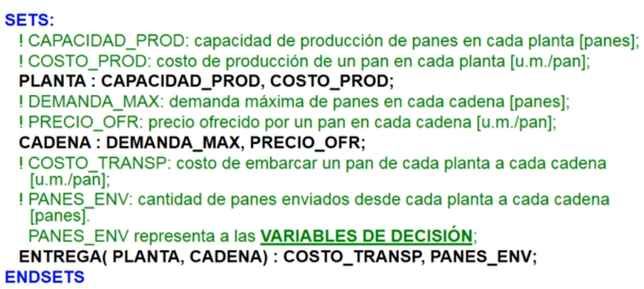

# Sintaxis de LINGO

### Capitalización
LINGO no distingue entre mayusculas y minusculas.

### Comentarios

```lingo
!Un comentario comienza con un signo de admiracion y termina con punto y coma;
```
### Expresiones
Las expresiones siempre terminan en punto y coma.

LINGO permite ponerle un nombre a la F.O. y a las restricciones anteponiendo la expresión `[<Nombre>]`:

```lingo
[FO] MAX = 100*XA + 120*XB;

[MAQUINADO] 4*XA + 8*XB <= 480;
...
```

### Variables

Las variables comienzan con un caracter alfabetico, y luego se admiten alfanumericos y guión bajo.

A menos que se especifique lo contrario, las variables de LINGO son $\geq 0$ y continuas. Si queremos cambiar esto, existen diferentes funciones para modificar el dominio (Pueden encontrarse en `Edit -> Paste Function -> Variable Domain`)

## Pantalla de solución del modelo

### Solver Status

+ **Model Class**: Tipo de modelo.
+ **State**: Optimo global, optimo local, factible, no factible, no acotado, interrumpido e indeterminado. Optimo local es una opción solo para problemas no lineales.
+ **Objective**: Valor de la F.O.

### Constraints
¿Por que hay una restricción más de la que puse? Porque LINGO cuenta la FO como restricción.

Las restricciones fijas como `X=5;` se toman como una "declaracion" de una constante y no se cuenta como restricción.

## Definición de conjuntos

```
SETS:
    !Conjuntos atómicos;
    <atomico_1>: <atrib_1>, ..., <atrib_n>;
    ...
    <atomico_n>: <atrib_1>, ..., <atrib_n>;

    !Conjuntos derivados;
    <derivado_1>(<atomico_1>,...,<atomico_m>): <atrib_1>, ..., <atrib_n>
ENDSETS
```

### Ejemplo:


## Definición de datos
### Ejemplo


A `COSTO_TRANSP` no hace falta darle nombre porque es parte de un conj. derivado, el nombre de cada elemento corresponde a un elemento del producto cartesiano entre los conj. atomicos que lo forman.

Notar que en el ejemplo, los atributos de conjunto definidos a los que no se le asignan datos terminan siendo las variables de mi modelo.

## Notación Matematica: Funcion de sumatoria

Para anotar sumatorias entre elementos de un conjunto se usa `@SUM()`

```
@SUM(<Conj.>(<Subindice>): <Expresion>)
```

### Ejemplo:


Hay una opción para ver que parentesis de cierre corresponde a cual de apertura y viceversa, como si fuera un editor de texto como VSCode.

## Notación Matematica: Conjuntos de restricciones

Para escribir una restricción por cada elemento de un conjunto, se usa la función `@FOR()`

### Ejemplo


`[DEMANDA]`, como vimos antes con la notación de corchetes, el nombre que se le indica a cada restricción (faltaria el subindice que se agrega automaticamente)

## Pantalla de solución (luego de las mejoras)
Te van a aparecer los datos como variables (parece que todos los atributos de conjuntos se toman como variables, y a algunas se le asignan valores por DATA).

## Otros
A veces es util ver el modelo por extensión, esto se puede hacer con `Solver -> Generate -> Display Model` (Esta opción tambien tiene el atajo `Ctrl+G`). Sirve para buscar errores.