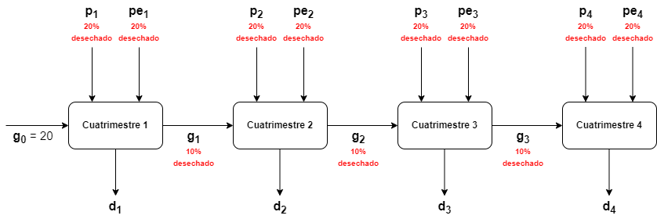
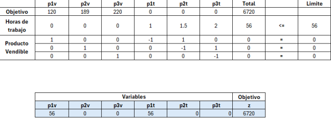
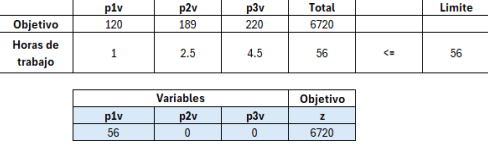

# GTP 1, Ejercicio 1

## Consigna

Una fábrica de artículos del hogar manufactura 2 artefactos A y B. Ambos sufren 3 procesos en el mismo orden, que son: maquinado, armado y montaje. Las disponibilidades de minutos diarios de cada proceso son: 480, 600 y 540 respectivamente. El artefacto A deja un beneficio de 100 \$/unidad, en tanto que el B proporciona 120 \$/unidad. En el proceso de maquinado se utilizan 4 minutos por cada unidad de artefacto A y 8 minutos por cada unidad de artefacto B. En el proceso de armado se utilizan 5 y 6 minutos respectivamente. Y finalmente, en el proceso de montaje se utilizan 12 y 8 minutos respectivamente. Formule el correspondiente modelo matemático para encontrar la combinación óptima de artefactos A y B, que haga máximo el beneficio que se obtiene de la venta de ambos.

## Datos

|         |Artefacto A|Artefacto B|Disponibilidad Total|
|---------|-----------|-----------|--------------------|
|Proceso 1|4          |8          |480                 |
|Proceso 2|5          |6          |600                 |
|Proceso 3|12         |8          |540                 |
|Beneficio|100        |120        |                    |

## Variables

+ $x_A$: Cantidad producida de Artefacto $A$ en un día (en unidades).
+ $x_B$: Cantidad producida de Artefacto $B$ en un día (en unidades).

## Modelo

$$
\text{max }z = 100x_A + 120x_B
$$

$$
\begin{align*}
\text{s.a.:}\\
&&4x_A + 8x_B & \leq && 480\\
&&5x_A + 6x_B & \leq && 600\\
&&12x_A + 8x_B & \leq && 540\\
&&x_A,x_B & \geq && 0\\
&&x_A,x_B & \in && \mathbb{Z}
\end{align*}
$$

# GTP 1, Ejercicio 4

## Consigna

Una empresa debe satisfacer la siguiente demanda: primer cuatrimestre, 30 unidades; segundo cuatrimestre, 20 unidades; tercer cuatrimestre, 40 unidades. Cada cuatrimestre, en producción regular, puede producir hasta 27 unidades, a un costo de \$ 40.– por unidad; pero puede producir en tiempo extra una cantidad ilimitada a un costo de \$ 60.– por unidad. De todas las unidades producidas, 20% se pierden por defectos. También al finalizar cada cuatrimestre, 10% de todas las unidades remanentes se echan a perder y no pueden usarse para demandas futuras. Guardar en inventario tiene un costo de \$ 15.– por unidad y por cuatrimestre. Formule un programa matemático que pueda usarse para minimizar el costo total de los próximos tres cuatrimestres. Asumir que 20 unidades aprovechables están disponibles en el comienzo del primer cuatrimestre.

## Diagrama del problema

## Variables
+ $x^p_i$: Cantidad de unidades de producto producido *en producción regular* durante el cuatrimestre $i$. $i \in \{1,2,3,4\}$.
+ $x^{pe}_i$: Cantidad de unidades de producto producido *en tiempo extra* durante el cuatrimestre $i$. $i \in \{1,2,3,4\}$.
+ $x^v_i$: Cantidad de unidades de producto vendidas durante el cuatrimestre $i$. $i \in \{1,2,3,4\}$.
+ $x^g_i$: Cantidad de unidades de producto almacenadas durante el cuatrimestre $i$. $i \in \{1,2,3\}$.

## Función objetivo

El objetivo es minimizar el costo total, comprendido por los costos de producción (distintos si se produce en producción regular) y los costos de almacenamiento en cada cuatrimestre.

$$
z = \sum_{i=1}^4 40x^p_i + \sum_{i=1}^4 60x^{pe}_i + \sum_{i=1}^3 15x^g_i
$$

## Restricciones

### Demanda minima por cuatrimestre

La empresa debe cumplir una demanda minima por cuatrimestre. Si llamamos $d_i$ a la demanda minima a cumplir en el cuatrimestre $i$:

$$
x^v_i \geq d_i,\quad i \in \{1,2,3,4\}
$$

### Producción regular maxima

De la consigna:

> Cada cuatrimestre, en producción regular, puede producir hasta 27 unidades [...]

$$
x^p_i \leq 27, \quad i \in \{1,2,3,4\}
$$

### Balance de entradas y salidas

Para cada uno de los cuatrimestres, lo que entra (por haber estado almacenado desde el cuatrimestre anterior, o por haber sido producido durante el cuatrimestre) debe ser igual a lo que sale (por ser almacenado, o por haber sido vendido).

Hay que tener en cuenta el dato de que el 20% de la producción es defectuosa, y por ende se desecha, lo mismo con el 10% de lo que esta almacenado desde el anterior cuatrimestre.

También tenemos el dato de que para el primer cuatrimestre se cuenta con 20 unidades aprovechables.

$$
\begin{align*}
&&20 + 0.8(x^p_1 + x^{pe}_1)&=&&x^v_1 + x^g_1\\
&&0.9g_1 + 0.8(x^p_2 + x^{pe}_2)&=&&x^v_2 + x^g_2\\
&&0.9g_2 + 0.8(x^p_3 + x^{pe}_3)&=&&x^v_3 + x^g_3\\
&&0.9g_3 + 0.8(x^p_4 + x^{pe}_4)&=&&x^v_4\\
\end{align*}
$$

### Naturaleza de las variables

Naturalmente, una variable que representa la producción, la demanda, o el almacenamiento de un objeto de la vida real ha de ser positiva, o a lo sumo nula. A su vez, como las variables refieren a unidades completas de cada producto, las variables deben ser enteras.

$$
x^p_i, x^{pe}_i, x^v_i, x^g_i \geq 0, \quad i \in \{1,2,3,4\}\\
x^p_i, x^{pe}_i, x^v_i, x^g_i \in \mathbb{Z}, \quad i \in \{1,2,3,4\}
$$

## Modelo

$$
\textbf{min }z = \sum_{i=1}^4 40x^p_i + \sum_{i=1}^4 60x^{pe}_i + \sum_{i=1}^3 15x^g_i\\
\begin{align*}
\text{s.a.:}\\
&&x^v_i &&\geq&&& d_i,&&\; i \in \{1,2,3,4\}\\
&&x^p_i &&\leq&&& 27,&&\;i \in \{1,2,3,4\}\\
&&20 + 0.8(x^p_1 + x^{pe}_1)&&=&&&x^v_1 + x^g_1\\
&&0.9g_1 + 0.8(x^p_2 + x^{pe}_2)&&=&&&x^v_2 + x^g_2\\
&&0.9g_2 + 0.8(x^p_3 + x^{pe}_3)&&=&&&x^v_3 + x^g_3\\
&&0.9g_3 + 0.8(x^p_4 + x^{pe}_4)&&=&&&x^v_4\\
&&x^p_i, x^{pe}_i, x^v_i, x^g_i &&\geq &&& 0, &&\; i \in \{1,2,3,4\}\\
&&x^p_i, x^{pe}_i, x^v_i, x^g_i &&\in &&& \mathbb{Z}, &&\; i \in \{1,2,3,4\}
\end{align*}
$$

# GTP 1, Ejercicio 5

## Consigna

*Una empresa produce tres productos: P1, P2 y P3 que pueden venderse a 120, 189 y 220 pesos por kilogramo, respectivamente. La fabricación de un kilogramo de P1 requiere 1 hs. de mano de obra. La fabricación de un kilogramo de P2 requiere 1,5 hs. de mano de obra y 1 kg. de P1. La fabricación de un kilogramo de P3 requiere 2 hs. de mano de obra y 1kg. de P2. Cualquier unidad de P1 que se usa para producir P2 no se puede vender. De igual manera, cualquier unidad de P2 que se utiliza para producir P3 no se puede vender. Se dispone de un total de 56 hs. de mano de obra.*

*Plantee un problema de programación lineal para maximizar los ingresos por ventas de la empresa.*

## Variables
+ $p_{iV}$: Producción del producto $i$ dedicada a ser vendida (en Kilogramos), $i \in \{1,2,3\}$. En forma vectorial: $\vec{p_V}$
+ $p_{iT}$: Producción **total** del producto $i$ (en kilogramos), $i \in \{1,2,3\}$. En forma vectorial: $\vec{p_T}$.

## Datos

+ $h_i$: Horas de trabajo necesarias para producir un kilogramo del producto $i$ (En hs. por kilogramo). En forma vectorial:

$$
    \vec{h} = \langle 1,1.5,2 \rangle
$$

+ $b_i$: Beneficio por producto (en \$ por kilogramo). En forma vectorial:

$$
    \vec{b} = \langle 120,189,220 \rangle
$$

+ $P_{ij}$: Cantidad de producto $i$ usada para producir un kilogramo de producto $j$ (en kilogramo por kilogramo). En forma matricial:

$$
    \mathbf{P} =
    \begin{bmatrix}
    0 & 1 & 0\\
    0 & 0 & 1\\
    0 & 0 & 0
    \end{bmatrix}
$$

## Modelo

$$
    \textbf{max } z = \vec{b} \cdot \vec{p_V} = \sum_{i=1}^{3}b_i \; p_{iV}
$$
$$
    \begin{align*}
    \text{s.t.:}\\
    &           &       & \vec{h}\cdot\vec{p_T}     & \leq\;    & 56        &   &\text{(Restricción de hs. de trabajo)}\\
    &\vec{p_V}  & +\;   & \mathbf{P}\cdot\vec{p_T}  & =\;       & \vec{p_T} &   &\text{(Restricciones de producto disponible)}\\
    &           &       & p_{iV},P_{iT}             & \geq\;    & 0         &   &\text{(Restricción de positividad)}
    \end{align*}
$$

### Solución por solver de Excel

## Modelo alternativo

Realizando algunas sustituciones (usando las restricciones de producto disponible) se puede llegar a un modelo equivalente de solo 3 variables ($p_{1V}$, $p_{2V}$ y $p_{3V}$)

$$
    \begin{align*}
    \textbf{max }   &   & z=\;  & 120\;p_{1V} & +\; & 189\;p_{1V} & +\; & 220\;p_{1V}\\ 
    \text{s.t.:}\\
                    &   &       & \;p_{1V}  & +\; & 2.5\;p_{1V} & +\;   & 4.5\;p_{1V}   & \leq\;    & 56\\
                    &   &       &           &     &             &       & p_{iV}        & \geq\;     & 0\\
    \end{align*}
$$

## Solución por solver de Excel
