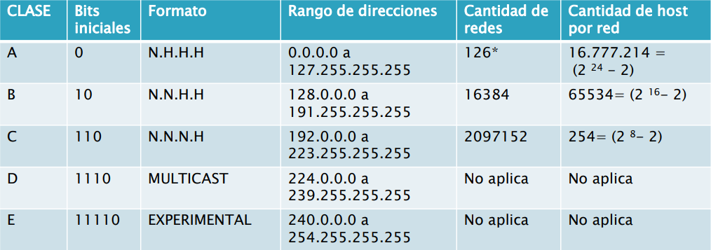
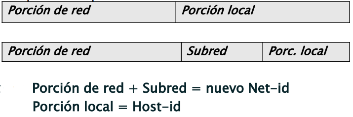
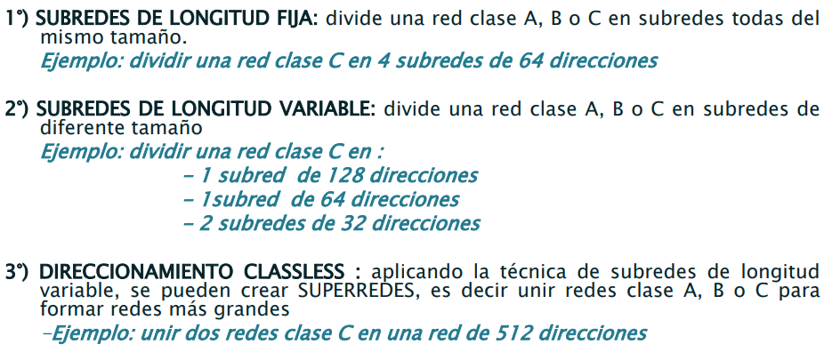
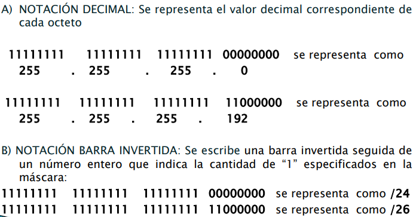

Nota: Las conexiones entre los routers, aunque no haya ningun host, también conforman una red.

Nota: Existen switches con funcionalidades de capa 3.

Cada interfaz de cada dispositivo de red en una inter-red, necesita un identificador.

A nivel de capa 2, existe la dirección MAC. Esta dirección se la asigna el fabricante (24 bits del fabricante, mas) y es casi imposible que en la misma LAN encuentren dos dispositivos con la misma MAC.

Ahora tenemos que poder identificar univocamente un dispositivo de red (en realidad, de una interfaz de un dispositivo de red) en la red de redes. "Un sistema de comunicación que suministra un servicio de comunicación universal necesita un método aceptado globalmente para identificar a cada host que se conecta el mismo".

TCP/IP estandarizo direcciones binarias de 32 bits conocidas como direcciones IP. A cada interfaz de un host o router se le asigna una dirección IP 

Nota: Si a dos interfaces les pones la misma IP: O uno no anda y otro si, ninguno anda, a veces anda uno y luego el otro... En general, un comportamiento erratico azaroso.

Una dirección IPv4 es una combinación única de 32 bits, separadas en cuatro octetos, a cada octeto lo representamos con su valor decimal correspondiente. Por supuesto, el maximo valor de un octeto es $2^8-1 = 255$

Por ejemplo: `00001010.00001010.00000001.00000001` es `10.10.1.1`

Estas direcciones no son planas, distintos bits tienen distintas funcionalidades. Mas especificamente, algunos son net-id (los n bits de mayor peso, identifican univocamente las redes) y otros host-id (los m restantes, distinguen las interfaces en una misma red).

Todos los dispositivos en la misma red, tienen el mismo net-id. Este net-id identifica univocamente a una red de las otras. Dentro de esa red, podemos variar los host-id.

**Red IP**: Interfaces con la misma net-id. Si estan en una misma net-id, los dispositivos son adyacentes entre ellos. Si son adyacentes, estan en la misma red IP? No necesariamente (por ejemplo, VLANs), pero la idea es que si (si se divide en capa 3, se divide en capa 2, de lo contrario podría devenirse en problemas de seguridad, por ejemplo).

No existe una unica manera de elegir los bits n y m, para net y host id. La manera original (que ya no se usa), se llama direccionamiento *classful*. Actualmente, el tamaño de net-id es flexible, y se denomina direccionamiento *classless*.

# Aclaraciones generales sobre el direccionamiento

+ **Tamaño de una red:** La cantidad de IPs asignables a una red.

+ Para cualquier direccionamiento, la dirección con *todos los bits de host en 0* no se puede usar. Esta dirección es la **dirección de red**, que representa a toda la red, y no se puede asignar a un host individual.

+ Siguiendo con el item anterior, aquella con *todos los bits de host en 1*, es la **dirección de broadcast dirigido**. Representa a todos los hosts de la red, y la puedo usar para enviar un broadcast a todos los hosts que estan conectados a la correspondiente red (esto no se usa mucho).

+ La dirección `255.255.255.255` esta reservada para broadcast limitado: Un datagrama destinado para todos los equipos que estan en mi red IP, sin importar cual sea mi red.

# Direccionamiento classful
Dividir las divisiones en clases (A hasta E). Solamente A, B y C sirven para asignar a una interfaz, D y E tienen otro objetivo, y no sirven para identificar interfaces.

## Clase A

+ La dirección `0.0.0.0` sirve para que un equipo que no tiene una dirección IP, pida una. Como no podes extraer una dirección de una red y usar las otras (no podes decir, `0.0.0.0` la reservo pero uso todas las otras `0.X.X.X`), tenes que reservar toda la red `0.0.0.0`.

+ `127.X.X.X`: El dispositivo se esta refiriendo a si mismo. Un paquete con este destino no sale al medio de comunicación, es un datagrama que el dispositivo se manda a si mismo. ¿localhost? Es una de las direcciones de loopback, generalmente `127.0.0.0`.

## Clase D
Las redes D es para multicast (si *broadcast* es para todos, multicast esta en el medio: ni para todos, ni para uno, para un grupo de destinatarios). ¿A que grupo se refiere cada dirección? Ya veremos. No es desición del administrador, dispositivos que usan cierto protocolo usan cierta dirección, por ejemplo.

## Problemas del direccionamiento classful
+ Solo tres tamaños de redes
+ Desperdicio de direcciones IP. En un principio esto no importaba.

Se penso como solución la implementación de **subredes**. Se implementan utilizando un único prefijo de red para multiples redes.

Lo que estas haciendo al fin y al cabo, es generar un net-id más grande. Entonces, la idea de clases empieza a diluirse. 

La solución fue evolucionando.

# Direccionamiento classless

En el direccionamiento classless, los bits para net-id y host-id dependen del administrador ¿Como hago? Usando una mascara de red.

## Mascara de red

Es una combinación de 32 bits, agrupados en 4 octetos. Aquellos bits que la mascara indique en 1, seran aquellos que la dirección de IP dedique al net-id, y en 0, aquellos que la dirección de IP dedique al host-id.

## Representaciones de la mascara de red

(Ejemplos en diapo.)

Nota: Si se hace una operación **AND** entre la Mascara de red y dirección IP, se recibe la dirección de red a la que pertenece esa dirección IP.

(Más ejemplos en diapo.)
