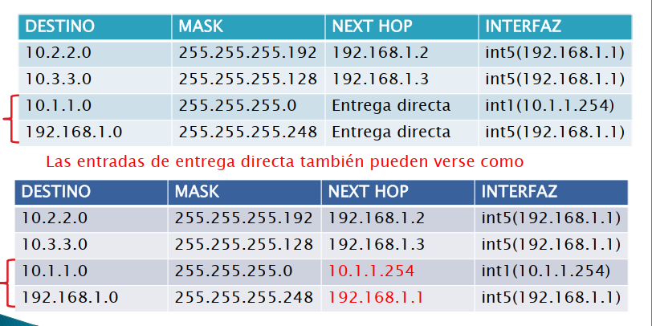
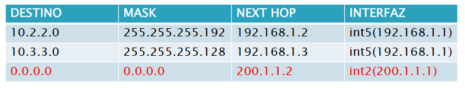
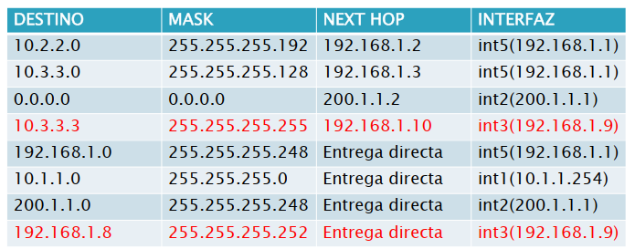

### Repaso Clase 3
+ Entrega indirecta = Sucesión de entregas directas.

# Estrategia de encaminamiento IP
+ IP brinda un servicio de datagramas (no confiable), dado un datagrama con origen A y destino B, cada dispositivo de la ruta de A hasta B solo determina el próximo dispositivo de la ruta.
+ Se denomina técnica del proximo salto (next hop).
+ Ningun dispositivo conoce el camino completo de A hasta B.
+ Los hosts y los routers toman decisiones de reenvío. Los routers estan dispuestos a recibir datagramas, analizarlos y reenviarlos. Los hosts el unico analisis que hacen es si los paquetes eran para ellos o no, y solo hace reenvío de los datagramas que él envia.
    + En resumen: Hosts solo generan y reciben datagramas, los routers ademas reenvian datagramas que no son suyos ni estan dirigidos a él.
+ Se mantiene la configuración de encaminamiento en los hosts a un minimo, y los routers contienen mucha información. "Los hosts descansan en los routers".
+ Los routers deben poder llevar un paquete a cualquier lado de la Internet.

Si tuvieras dos caminos cargados en una tabla de forwarding. IP no dice nada sobre esto. Algunos routers con funcionalidades extra que hacen balanceo de cargas (mandan algunos paquetes por una ruta y otros por la otra para evitar saturación). Si lo quiero utilizar como camino alternativo porque el otro se puede caer, hay que usar alguna tecnica de encaminamiento dinámico.

# Reenvio guiado por tablas

+ La tabla de reenvio siempre existe, y puede modificarse manual o automaticamente. Se agregan, modifican y borran entradas.
+ Existe una tabla de ruteo y de reenvio (esta ultima es la que consulta IP).
+ La tabla de reenvio no esta estandarizada. IP no da un formato exacto.

*Falta algo de esta diapo.*

## Tablas de reenvio
*(En el curso se usa una tabla basica que contiene la información que tienen todas las tablas de ruteo. Las implementaciones pueden agregar info. como si una entrada se ingreso manual o automaticamente, u otra información para ruteo dinamico)*

|Destino|Mask|Next Hop|Interfaz|
|-|-|-|-|
|-|-|-|-|

Cada tabla contiene info. para dos acciones.
+ Decidir si la fila contiene información que puede ser utilizada para reenviar el datagrama que se esta procesando.
    + Columnas **Destino** y **Mask**. A veces se unen en una sola columna usando la representación de barra invertida de la mascara.
+ Una vez seleccionada la fila de la tabla, esta debe indicar que accion tomar con el datagrama: Hacer una entrega directa o debe indicar el proximo salto.
    + Columnas **Next Hop** e **Interfaz**.

### ¿Cuantas filas pongo en la tabla?

Obviamente no se pueden poner todos los destinos posibles.

En cambio, basandose en que todos los destinos en una red subyacente comparten un prefijo. Tipicamente el router selecciona el mismo próximo salto para todas las direcciones de una red IP.

Una fila de una tabla de reenvío puede servir para encontrar el próximo salto:
1. Para todos los hosts de una misma red IP.
2. Para un solo host (Por que, por más que es impractico tener filas para todos los destinos, a veces si es util especificar destinos especificos)
3. Para todos los hosts de más de una red IP.

## Construcción de tablas

*Agregar diagramas diapo.*

Debemos agregar info. para que el router 1 sepa como entregar datagramas destinadas a destinos en las redes 10.2.2.0/26 y 10.3.3.0/25.

|Destino|Mask|Next Hop|Interfaz (*)|
|-|-|-|-|
|10.2.2.0|255.255.255.192|192.168.1.2|int5 o 192.168.1.1|
|10.3.3.0|255.255.255.128|192.168.1.3|int5 o 192.168.1.1|

*(\*)* La columna de interfaz, dependiendo de la implementación, se especifica con el nombre de la interfaz o con la dirección IP de la interfaz

### Filas de entrega directa

Estas filas estan siempre, y el next hop se marca como entrega directa (cada implementación lo marca a su manera). O, en implementaciones viejas, se pone "a si mismo".

Asi, existen filas de entrega indirecta y de entrega directa. Y las de entrega directa siempre aparecen automaticamente, nunca las tengo que insertar.

### Rutas por omisión

¿Que significa la nube? Redes que desconocemos, o que conocemos, pero son muchisimas. Para todas estas redes, la decisión de reenvío es la misma.

Se puede agregar una entrada adicional que especifica una ruta por defecto. El algoritmo solo analiza esta entrada si ninguna de las otras entradas concuerda.

Esta entrada resulta util cuando:
+ Un conjunto de redes desconocidas se alcanzan a traves de un mismo router.
+ Una elevada cantidad de redes se alcanzan a traves de un unico router.
+ En las tablas de los hosts.

Esta fila se ve asi:

Notar que si existen dos "nubes", este approach no es util.

### Rutas a un host especifico

Este caso especial puede darse cuando:

+ Enviar el trafico para ciertos hosts a lo largo de una ruta y el trafico para el resto de los hosts a lo largo de otra (ej.: ese host es un servidor)
+ Se puede instalar y probar una nueva red en paralelo mediante el reenvío de tráfico hacia hosts específicos sobre la nueva red.
+ Seguridad. Un administrador puede utilizar rutas hacia hosts específicos para dirigir el tráfico a través de sistemas de seguridad.

Para especificar estas filas, en Destino se ubica la IP exacta del host de destino, y la mascara se pone en todos 1s (255.255.255.255), *esta no se usa como mascara del destino sino para indicar para qué sirve esta fila*.

Otras entradas que pueden aparecer, son aquellas que uso cuando el mensaje es para mi mismo. Notar que hay una entrada para la red de loopback y para cada una de mis interfaces, en todos estos casos, el mensaje es para mi mismo.

# Algoritmo de reenvío

*El algoritmo está de manera más especifica en pseudocodigo, en las diapositivas*

## Concepto

Conceptualmente, el algortimo define el siguiente comportamiento
1. Extraer del datagrama la dirección IP destino, $D$.
2. Revisar si el datagrama es para él mismo (unicast, broadcast, loopback)
3. Si no, revisar si es posible realizar entrega directa, de ser así realizar entrega directa a traves de la red.
    + Recien si llega a este paso comienza el proceso de **reenvío**.
4. Si no, revisar si existe una entrada con el prefijo de red de D, y reenviar el datagrama al proximo salto.
5. Si no, revisar si existe una entrada de ruta por defecto y reenviar el datagrama al proximo salto especificado por esta entrada.
6. Si no existe ruta por omisión, declarar un error de reenvío.

Pero el encabezado del datagrama no incluye la mascara para determinar el prefijo de red de $D$. Se usa la columna de mascara de cada fila, operando AND con la dirección de destino $D$, y si este resultado coincide con la columna Destino, se elige el proximo salto de esa fila.

Ademas, para cada uno de los pasos del algoritmo, no se recorren las entradas de la tabla aleatoriamente, se toma el criterio:
+ De la mas especificas (columna Mask con mayor cantidad de 1s), que incluye los envios a hosts especificos y mensajes para si mismo... 
+ Hasta las más generales (columna Mask con menor cantidad de 1s), que incluye todas las otras filas (de entrega directa e indirecta) y por ultimo la fila por default (que directamente no tiene ningún uno).

*Entonces, por ejemplo, si existe una entrada para dos redes que se solapan 10.0.0.0/25 y 10.0.0.0/24, siempre se tomará la entrada correspondiente a 10.0.0.0/25, porque la mascara es "mas especifica"*

# Tabla de reenvío de un host
La tabla de reenvío de un host solo necesita una entrega indirecta, podemos definir a R1 como próximo salto en la ruta por omisión.

"Obtener mi IP automaticamente" no solo te configura una IP, sino que también te asigna una puerta de enlace.

# Sumarización de rutas
Si multiples redes que forman una superred *(\*)* comparten un mismo Next Hop, pueden englobarse en una misma fila.

En ruteo dinamico, los routers sumarizan automaticamente. Si no, se hace manualmente y queda a cargo del administrador. Conviene sumarizar no porque cambie el comportamiento sino porque, al ser más corta la tabla, la consulta es más rapida, más eficiente.

*(\*)* Las redes deben ocupar todo el espacio de la superred, sino no se puede sumarizar. 10.3.3.0/25 y 10.3.3.128/26 no ocupan todo el espacio de 10.3.3.0/24, 10.3.3.0/25 y 10.3.3.128/25 si.

# Time To Live (TTL)

Es muy facil crear bucles con default routers, aunque se puede dar incluso sin la presencia de estos.

Para eso, los datagramas tienen un campo TTL de 8 bits con una cantidad de saltos total que puede dar.

Así se evitan bulces eternos, cada ruteador decrementa el contador en 1 y si el contador llegó a 0 *(\*)*, de descarta.

*(\*)* No cuenta para casos donde el datagrama es para el router, porque ahi _no hay reenvío_.

El TTL no cuenta la cantidad maxima de saltos, cuenta la cantidad maxima de redes que atraviesa el datagrama.

# Notas
+ Las rutas deben configurarse de ida y de vuelta.
+ Los bucles se dan cuando hay que hacer entrega indirecta.