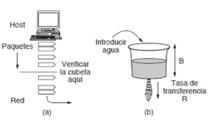
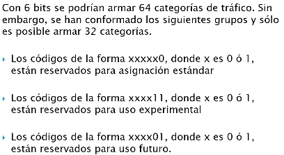
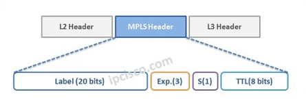

# Quality of Service

En un principio, las aplicaciones no tenían requerimientos especiales de red. La red funcionaba de la misma manera siempre. A principios de los 00s, se vio que distintas aplicaciones podían tener requerimientos especiales de ciertas **caracteristicas de tráfico**:

+ Ancho de banda.
+ Retardo.
+ Jitter (variación del retardo).
+ Pérdida de paquetes.

*Ejemplo:* una transmisión de video puede requerir mucho ancho de banda, pero soportar perdida de paquetes, mientras que el envío de un correo electronico no requiere tanto ancho de banda, pero no soporta perdida de paquetes. 

## SLA (Service Level Agreement)
Contrato entre una empresa de comunicaciones y un particular, en el que la empresa de comunicaciones se compromete a brindar un servicio de red que cumple con ciertos parametros de calidad.

Incluye cuestiones no tecnologicas com tarifas (puede ser fija o dependiente del trafico) y de capacidades de dispositivo/red.

SLS es el compotente tecnologico del SLA respecto de:
+ Los niveles de las caracteristicas del servicio
+ El conjunto de metricas asociadas.

---

El acuerdo con la empresa de comunicaciones es valido solo si no se sobrepasa una cierta cantidad de trafico. Si esto no se da, el trafico que este por sobre el limite es suceptibles a no cumplir con los parametros de calidad. Para regular las rafagas de trafico (frecuentes en muchas aplicaciones), que pueden causar que se sobrepase este limite, se realiza un **modelado de trafico**. Es una tecnica para regular la tasa promedio y las ráfagas de un flujo de datos que entra a la red.

## Tecnicas de modelado de trafico

### Leaky Bucket

El balde es un buffer y el agua es trafico. La idea **es enviar trafico a una tasa constante $R$**. Si las aplicaciones generan trafico a un ritmo mayor al seleccionado, este trafico se almacena para seguir enviandose respetando la tasa de transferencia.

Si dejas de tener lugar en el buffer obviamente tenes un problema. La idea es usar esta tecnica cuando normalmente las aplicaciones generan bits a una tasa similar a la de transferencia, con ocasionales picos de actividad que permitan al buffer almacenar sin inconvenientes.

### Token Bucket

Es similar a Leaky Bucket, pero no igual ("el balde no esta agujereado"). Entra el concepto de "tokens" o permisos para transmitir que se generan a una tasa constante.

En este caso, si se permiten diferentes variaciones en la velocidad de envio. En Leaky Bucket, siempre se transmite a una tasa R dada. Acá, si existe un pico de generación de trafico, y hay cierta cantidad de tokens acumulados, se puede enviar toda la cantidad de trafico que estos tokens permitan, que es potencialmente superior al limite de trafico acordado.

Por esto, esta tecnica se prefiere cuando el trafico fuera de limites no se elimina, sino que se marca como excedente, para que si hay necesidad de descartar paquetes, sean esos.

# Modelos de QoS
+ **Best effort**: No admite calidad de servicio.
+ **Servicios integrados**: Las aplicaciones requieren de la red QoS.
  + Tuvo varios problemas y no se terminaron implementando. Por ejemplo: Las aplicaciones tienen que solicitar sus requerimientos de calidad de servicio, pero no todas las aplicaciones estan escritas pensando en eso.
+ **Servicios diferenciados**: La red reconoce clases de trafico que requieren QoS. Puede convivir con MPLS que implementa calidad de servicio sobre redes IP. La red reconoce el tipo de trafico y le asigna una categoria de QoS y le da un tratamiento acorde.

## Servicios integrados (Intserv)
**Flujo:** Stream distinguible de paquetes IP vinculados que resultan de la actividad de un unico usuario y requieren la misma QoS.

Notar que el flujo se asume unidireccional. Una video conferencia podemos reconocer cuatro flujos, voz y video de ida, y voz y video de vuelta.

### Funciones

La idea es que se reserven recursos para cada flujo. En cada router que pasa ese flujo se reservan recursos para el mismo, y ademas un control de admisión (Si no hay suficientes recursos en todos los dispositivos para garantizar QoS solicitado, entonces el flujo no
se admite). El protocolo que resuelve esto se llama RSVP.

A diferencia de IP, hay que implementar un sistema de colas para tener una manera de seleccionar el proximo datagrama a procesar en base a otros parametros, y no el momento en que llego (FIFO).

También debe existir una politica de descarte.

### Categorias de servicio

Intserv divide a los flujos en cierta categorias:

+ Garantizado: Velocidad de transferencia garantizada, retardo maximo y **sin** perdida por overflow.
+ Carga controlada: Servicio similar a best effort en baja carga (la probabilidad que algo se descarte es muy baja), bajo porcentaje superra el retardo maximo, alto porcentaje de paquetes llega a destino. 
+ Best effort: Servicio nativo de IP, sin calidad de servicio.

### Problemas
+ Todos los routers deben soportar RSVP.
+ Protocolo tipo soft state. Los routers deben controlar el flujo, lo que incluye verificar que una conexión sigue activa, que implica intercambió extra de información con sus vecinos que sobrecarga la red.
+ Los routers "core" se ven sobresaturados.

## Servicios diferenciados (Diffserv)
Son los más difundidos.

Los paquetes IP se etiquetan para un tratamiento de QoS utilizando el octeto **tipo de servicio** del encabezado IPv4.

Se usan 6 bits de este octeto para Diffserv y 2 para notificación explicita de congestión.

En realidad, solo 5 bits se terminan usando para distinguir categorías:

### Categorías
+ Expedited forwarding o premium.
+ Assured forwarding.
+ Best effort.

Los dos bits de mayor peso definen la clase, y los tres que quedan se usan para definir "subclases" (en realidad, solo existen para una sola).

### Expedited forwarding o premium
+ Codigo: 101110.

Es la que brinda mayor certeza

Su comportamiento se corresponde con una linea virtual dedicada.

Ofrece la posibilidad de garantizar en el SLA practicamente todos los parametros relativos a calidad de servicio: Ancho de banda minimo, tasa maxima de perdida de paquetes, retardo maximo, jitter maximo.

### Assured forwarding

Existen cuatro subclases dentro de AF. Mientras mas alto, mayor calidad de servicio. En los routers pueden asignarse recursos (ancho de banda y espacio en buffers) independientes para cada clase AF. El nombre de esta clase es engañoso porque en realidad no hay garantías de envío. Para la clase AF se garantiza un trato preferente con respecto a la clase Best Effort y las AF de clase inferior, pero no hay garantías de parámetros de QoS como en la clase Premium. A su vez, dentro de cada una, se codifica cada paquete con una probabiliad de descarte (alta, media o baja).

# MPLS

Soluciona el problema de IP de no poder trabajar con flujos o conexiones. Pero no esta pensado para trabajar solo con IP (por eso multi-protocol). Lo puedo usar yo en mi intranet, el proveedor de internet, es muy flexible...

No es correcto decir que se encapsula el trafico IP en MPLS. Lo que sucede es que el trafico IP termina inserto en tráfico MPLS, y las decisiones de forwarding se toman en base a datos de MPLS y no de IP. La decisión se toma en un función de un valor llamado **Etiqueta**.

**Minimo overhead de ruteo.** El proceso de forwarding es más rapido en MPLS, ya que las tablas son más pequeñas (en general)

**Ingeniería de tráfico**: Tanto en OSPF como RIP, se elige un solo proximo salto posible para el reenvío; RIP almacena solo uno de menor costo, OSPF puede almacenar varios con el mismo costo pero efectivamente usa solo uno, y ninguno de ellos almacena alternativas de mayor costo. Entonces, se dificulta la implementación de **balanceo de carga**.

**Redes privadas virtuales (VPN)**: Generalmente usamos la red publica. Eventualmente podemos querer implementar sobre la red publica una conexión entre dos extremos que sea completamente privada. El uso es el mismo que tener un "cable" mio entre esas dos redes formando una intranet.

### MPLS en el modelo de capas

Esta ubicado en una "capa 2.5". Hace uso de los servicios de capa 2 y "encapsula" el trafico de capa 3. Es el unico protocolo de capa 2.5.

Ahora, la capa 3 usa los servicios de la capa 2.5.

¿Puede hacerse una analogía con la subcapa MAC? No realmente, ya que la subcapa MAC es simplemente la parte de la capa 2 que resuelve el (importante) problema de acceso al medio, mientras que esta capa 2.5 es una manera alternativa de resolver el problema del reenvío.

## Encabezado MPLS

Aca se ve porque MPLS no encapsula realmente el paquete de capa 3. MPLS simplemente antepone su encabezado entre el encabezado de capa 2 y de capa 3. No tiene definida un area de datos.

## Terminología MPLS

Cada router en la red MPLS existe una **tabla de etiquetas**.

**Label Switching Router:** Router completamente contenido en la red MPLS, que tiene capacidad de realizar reenvío basado en etiquetas.

**Label Edge Router:** LSR de entrada/salida de la red MPLS. Conocidos como LSR-ingress y LSR-egress respectivamente. Son los LSR "de borde" de la red MPLS.

## Forwarding Equivalence Class

Se hace una partición de conjunto de todos los posibles paquetes en clases de equivalencia llamadas Forwarding Equivalence Classes (FECs).

Una FEC representa un grupo de paquetes que serán reenviados de la misma manera. Una vez asignados a una FEC los paquetes son indistinguibles desde el punto de vista de su reenvío (pueden tener destino en una misma subred o una distinta, pero el forwarding se hace de la misma manera).

El router de ingreso, en base a unos parametros del datagrama y una configuración del router de ingreso, clasifica los paquetes que entran.

---

Cada FEC tiene asociado
1) Un camino (unicast/multacast) a traves de la red.
2) Una caracterización de tráfico, requerimientos de QoS para ese flujo.

A cada FEC se le asocia un valor de etiqueta inicial, diferentes a los de las otras FEC.

**Nota:** El trafico de un mismo origen puede tener diferente tratamiento dentro de una red MPLS si ingresa a ella por dos LSR-ingress distintos, ya que la configuración de las FEC es propia de cada uno.

---

El FEC al que está asignado un paquete se puede determinar mediante 1 o más parametros

+ Direcciones IP de origen o destino.
+ Dirección de una red IP.
+ Numeros de puerto origen o destino.
+ ID del campo protocol IP (ICMP, TCP, UDP).
+ Codepoint de DS (Enforced Forwarding, AF, ...).

---

Incluso, cuando se entra a la red MPLS se puede definir un tunel, un camino exacto que atravesaran los paquetes pertenecientes a una FEC, conformandose efectivamente circuitos virtuales.

## Operaciones sobre etiquetas
+ **Push**: Lo realizan los LSR-ingress, basandose en su configuración de FECs.
+ **Swap:** Realizar un cambio en la etiqueta. Lo realizan los LSR ya que la elección de etiqueta es local.
+ **Pop:** Puede incluso hacerlo el penultimo salto, o el router anterior al LSR-egress (**P**enultimate **H**op **P**opping). Esta permitido porque el LSR-egress ya no toma decisiones de forwarding en base a las etiquetas. Puede ser util para no sobrecargar el procesamiento de los LER de salida. Incluso, el trabajo es más eficiente porque hacer un Pop y un Swap es lo mismo para el penultimo salto en terminos de costo de procesamiento.

## LSP (Label Switched Path)

Antes de reenviar los paquetes pertenecientes a un FEC se define un camino a traves de la red: un LSP.

Se necesita:
+ Un protocolo de ruteo interior para que a nivel de IP se conozcan las rutas a cada uno de los destinos posibles.
+ Un protocolo para determinar la ruta y establecer los valores de etiqueta entre LSRs adyacentes (LDP o RVSP). *LDP (Label Distribution Protocol) se le llama tambien en general a los protocolos que sirven para asignar caminos a los FEC, o especificamente a uno de los estandares.*

Un LDP es un conjutno de procedimientos por los cuales un LSR informa a otro de las asociaciones FEC - Label que ha hecho. Dos LSR que intercambian información mediante un LDP se llaman "label distribution peers".

Siempre, el valor de etiqueta que se usa para un vinculo entre un LSR-upstream y un LSR-downstream, donde el trafico va de upstream a downstream, es dado por el LSR-downstream (sea solicitado o no).

## Apilamiento de etiquetas

Como de una red MPLS se puede entrar a otra, se permite el apilado de encabezados MPLS. El procesamiento se realiza con el encabezado más exterior, y el encabezado del fondo de la pila (el más proximo al paquete de capa 3) se marca con bit 1 en "Bottom of Stack"