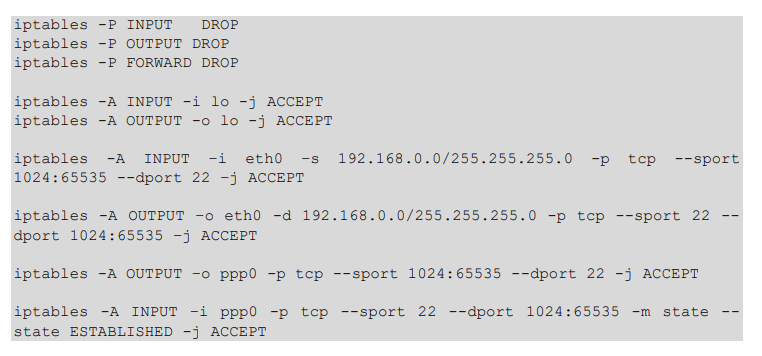
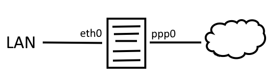

# Ejercicio 1


## 1.a)

> Analice las reglas de firewall. Explique, coloquialmente, el resultado de esta configuración, indicando qué servicios puede brindar y a quién, qué servicios puede acceder y dónde, y el tráfico ICMP permitido.



+ Por default, rechaza todo el trafico entrante, saliente y de reenvio para todas las interfaces.
+ Acepta el trafico entrante y saliente a la interfaz de loopback (`lo`).
+ Permite que puedan realizarse conexiones SSH de la LAN `192.168.0.0/24` con cualquier host.
+ Permite acceder al servicio SSH de hosts externos.
+ Trafico ICMP solo estaria permitido en `lo`.

## 1.b)

```sh
iptables -A OUTPUT -p icmp --icmp-type echo-request -j ACCEPT
iptables -A INPUT -p icmp --icmp-type echo-reply -j ACCEPT
iptables -A INPUT -p icmp --icmp-type echo-request -j ACCEPT
iptables -A OUTPUT -p icmp --icmp-type echo-reply -j ACCEPT
```

## 1.c)

| N    | Interfaz | Sentido de flujo | Direcc. Origen | Direcc. Destino | Protocolo | Puerto Origen | Puerto Destino | ACK   | Accion  |
| :--- | :------- | :--------------- | :------------- | :-------------- | :-------- | :------------ | :------------- | :---- | :------ |
| 1    | eth0     | IN               | 192.168.0.0/24 | 0.0.0.0/0       | TCP       | >1023         | 22             | SI/NO | Aceptar |
| 2    | eth0     | OUT              | 0.0.0.0/0      | 192.168.0.0/24  | TCP       | 22            | >1023          | SI/NO | Aceptar |
| 3    | ppp0     | OUT              | 0.0.0.0/0      | 0.0.0.0/0       | TCP       | >1023         | 22             | SI/NO | Aceptar |
| 4    | ppp0     | IN               | 0.0.0.0/0      | 0.0.0.0/0       | TCP       | 22            | >1023          | SI    | Aceptar |
| 5    | lo       | I/O              | 0.0.0.0/0      | 0.0.0.0/0       | _         | _             | _              | _     | Aceptar |
| 6    | _        | I/O/F            | 0.0.0.0/0      | 0.0.0.0/0       | _         | _             | _              | _     | Denegar |

# Ejercicio 2

La configuración del firewall del host 192.168.0.1/24

```sh
iptables -P INPUT DROP
iptables -P OUTPUT DROP
iptables -P FORWARD DROP

## Empezamos a filtrar
iptables -A INPUT -i lo -j ACCEPT
iptables -A OUTPUT -o lo -j ACCEPT
iptables −A INPUT −s 192.168.0.200 −p tcp −−dport 3306 −j ACCEPT
iptables −A OUTPUT −d 192.168.0.200 −p tcp −−sport 3306 -m state --state ESTABLISHED −j ACCEPT
iptables −A INPUT −s 10.1.45.194 −p tcp −−dport 20:21 −j ACCEPT
iptables −A OUTPUT −d 10.1.45.194 −p tcp −−sport 20:21 −j ACCEPT
iptables −A INPUT −p tcp −−sport 80 −j ACCEPT
iptables −A OUTPUT −p tcp −−dport 80 −j ACCEPT
iptables -A INPUT –s 192.168.0.0/24 -p icmp --icmp-type echo-request -j ACCEPT
iptables -A OUTPUT –d 192.168.0.0/24 -p icmp --icmp-type echo-reply -j ACCEPT
```
+ a) Puede acceder al puerto 3306 del equipo siempre que:
  + El host este usando el puerto 3306, y
  + El equipo ya haya establecido la conexión, desde su puerto 3306.
+ b) Si, se puede establecer una conexión.
+ c) Se permite el trafico entrante con origen en el host 10.1.45.194 sin importar la direccion ip de destino, con el protocolo TCP con puertos de destino 20 y 21. Se permite establecer la conexion y usarla. Se permite el trafico de salida con direccion ip de destino 10.1.45.194, con el protocolo TCP, con puertos de origen 20 y 21
+ d) Si, el host puede navegar por internet siempre que sea un sitio que utilice el protocolo http por la regla `iptables −A OUTPUT −p tcp −−dport 80 −j ACCEPT` ya que puede abrir conexiones y usarlas con dispositivos de cualquier IP en el puerto 80. Y además, el host puede recibir trafico de entrada originado bajo cualquier direccion IP con puerto de origen 80: `iptables −A INPUT −p tcp −−sport 80 −j ACCEPT`. No obstante, el host no puede navegar por sitios web que utilicen el protocolo https.
+ e) No, porque no hay reglas especificas que indiquen que el servidor puede recibir conexiones entrantes hacia el puerto 80 o 443 para actuar como servidor.
+ f)
  1. Si, las reglas de ICMP lo permiten.
  2. No, las reglas de ICMP solo permiten responder pings.
  3. No, no se permiten mensajes ICMP de fuera de la LAN.
  4. No, no se permiten mensajes ICMP hacia afuera de la LAN.
  5. No, se rechaza por politica por defecto,
  6. No, se rechaza por politica por defecto.
+ g) Las ultimas dos reglas deberian cambiar de `-s` a `-o` y viceversa:
    ```
    iptables -A INPUT –s 192.168.0.0/24 -p icmp --icmp-type echo-request -j ACCEPT
    iptables -A OUTPUT –d 192.168.0.0/24 -p icmp --icmp-type echo-reply -j ACCEPT
    ```
+ h) Se deberían agregar las reglas:
    ```
    iptables -A INPUT -s 192.168.0.0/24 -p tcp --sport 64:65535 --dport 25 -j ACCEPT
    iptables -A OUTPUT -d 192.168.0.0/24 -p tcp --sport 25 --dport 64:65535 -m state --state ESTABLISHED -j ACCEPT
    ```

# Ejercicio 3

```sh
echo -n Aplicando Reglas de Firewall...

## Limpieza de reglas existentes
iptables -F
iptables -X
iptables –Z

## Establecemos política por defecto
iptables -P INPUT DROP
iptables -P OUTPUT DROP
iptables -P FORWARD DROP

## Empezamos a filtrar
iptables -A INPUT -i lo -j ACCEPT
iptables -A OUTPUT -o lo -j ACCEPT
iptables -A INPUT -p tcp -s 0/0 --sport 1024:65535 -d 181.144.250.1 --dport 80 -m state –-state NEW,ESTABLISHED,RELATED -j ACCEPT
iptables -A OUTPUT -p tcp -s 181.144.250.1 --sport 80 -d 0/0 --dport 1024:65535 -m state –state ESTABLISHED,RELATED -j ACCEPT
iptables -A INPUT -p TCP -s 0/0 --sport 1024:65535 -d 181.144.250.1 --dport 443 -m state –-state NEW,ESTABLISHED,RELATED -j ACCEPT
iptables -A OUTPUT -p tcp -s 181.144.250.1 --sport 443 -d 0/0 --dport 1024:65535 -m state –-state ESTABLISHED, RELATED -j ACCEPT
```


