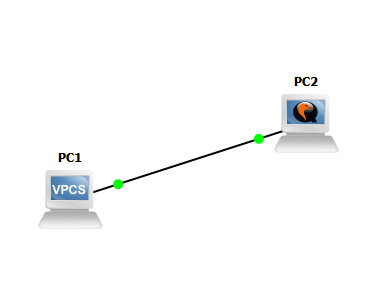

La **topología** elegida es la siguiente:



# Inciso a)
Se le asignó la primera host-id a la PC1 y la segunda a la PC2

En la consola de PC1:
```
PC1> ip 10.0.0.1/25
```

En la consola de PC2:
```
ubuntu@ubuntu-cloud:~$ sudo ifconfig ens3 10.0.0.2/25
```