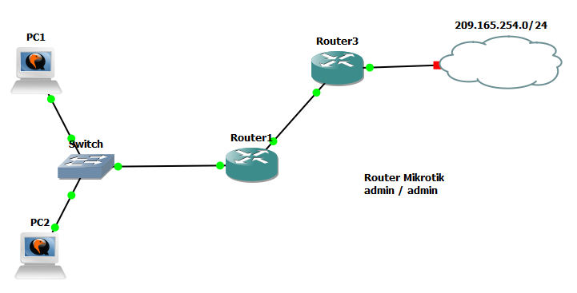

# Topología de red



# Paso 1

Se configura la IP de la PC1.
```
sudo ifconfig ens3 192.168.1.10 netmask 255.255.255.0
```

Se configura la IP de la PC2.
```
sudo ifconfig ens3 192.168.1.2 netmask 255.255.255.0
```

*En ambos host me salía el error*
```
sudo: unable to resolve host ubuntu: Connection refused
```

*Pero las IPs se seteaban correctamente de cualquier manera.*

# Paso 2 y 3
Luego de asegurarme que las tablas ARP esten vacias, hago el ping de PC1 a Router1. Las tablas de PC1 y PC2 luego del intercambio de mensajes:

#### PC1
```
? (192.168.1.254) at 0c:3f:7a:1d:00:00 [ether] on ens3
```

#### PC2
*Vacía*

La tabla del Router debería tener la información de PC1.

*Despues, usando el comando:*

```
[admin@Router1] > /ip arp print where interface=ether1
```

*Obtuve el resultado (esperado):*
```
Flags: D, P - PUBLISHED; C - COMPLETE
Columns: ADDRESS, MAC-ADDRESS, INTERFACE
#    ADDRESS       MAC-ADDRESS        INTERFACE
1 DC 192.168.1.10  0C:A4:D8:7B:00:00  ether1
```
# Paso 4

#### PC1
```
? (192.168.1.254) at 0c:3f:7a:1d:00:00 [ether] on ens3
? (192.168.1.2) at 0c:96:5b:10:00:00 [ether] on ens3
```

#### PC2
```
? (192.168.1.10) at 0c:a4:d8:7b:00:00 [ether] on ens3
```

Ahora la tabla de PC2 no esta vacía sino que tiene la info. de PC1, y PC1 agrega la info de PC2.

### Captura de trafico
|No.|Time     |Source           |Destination      |Protocol|Length|Info                                  |
|---|---------|-----------------|-----------------|--------|------|--------------------------------------|
|13 |23.023833|0c:a4:d8:7b:00:00|Broadcast        |ARP     |42    |Who has 192.168.1.2? Tell 192.168.1.10|
|14 |23.025335|0c:96:5b:10:00:00|0c:a4:d8:7b:00:00|ARP     |42    |192.168.1.2 is at 0c:96:5b:10:00:00   |
|21 |28.031437|0c:96:5b:10:00:00|0c:a4:d8:7b:00:00|ARP     |42    |Who has 192.168.1.10? Tell 192.168.1.2|
|22 |28.032466|0c:a4:d8:7b:00:00|0c:96:5b:10:00:00|ARP     |42    |192.168.1.10 is at 0c:a4:d8:7b:00:00  |

En los primeros dos mensajes, PC1 quiere iniciar un intercambio de mensajes con PC2, para ello pregunta por su direccion MAC mediante el primer mensaje, un ARP request.

PC2 reconoce este mensaje como propio y genera el segundo mensaje, un ARP reply.

Cinco segundos despues, en el tercer y cuarto mensaje se da un intercambio similar, pero al revés. PC2 genera la ARP request, que no se envía como broadcast sino como unicast directamente a PC1, y luego PC1 responde normalmente con un ARP reply dirigido a PC2. Esto parece ser un refinamiento de ARP, en el que el receptor de una ARP request despues busca verificar la información sobre el emisor de dicha request. Notar también que este refinamiento se dió por más de que ya había terminado el intercambio de mensajes (La opción `-c 1` limitaba el ping a solo uno).

# Paso 5

Despues de pingear a 10.0.0.1 (interfaz de Router3, fuera de la red de PC1), la tabla ARP de PC1 queda:

```
? (192.168.1.254) at 0c:3f:7a:1d:00:00 [ether] on ens3
```

Recopila la MAC de su puerta de salida, la interfaz de Router1 con dirección IP 192.168.1.254. PC1 solo planifica el proximo salto hacia Router1, le envia una trama (o varias) y el contenido de las mismas seran los paquetes que Router1 ayudara a hacer llegar a su destino final.

# Paso 6

Si se pingea a `209.165.254.85`, el resultado es el mismo que en el paso anterior. Al tratarse de un host remoto (fuera de la LAN de PC1), la información que deberá guardar PC1 en su tabla ARP no es la del destino final sino la de su puerta de salida. 

```
? (192.168.1.254) at 0c:3f:7a:1d:00:00 [ether] on ens3
```

# Paso 7

La tabla ARP de Router1 es:

```
Flags: D, P - PUBLISHED; C - COMPLETE
Columns: ADDRESS, MAC-ADDRESS, INTERFACE
#    ADDRESS       MAC-ADDRESS        INTERFACE
0 DC 192.168.1.10  0C:A4:D8:7B:00:00  ether1
1 DC 10.0.0.2      0C:0C:87:62:00:02  ether3
```

No tiene una entrada para `209.165.254.85` por que `209.165.254.85` *tampoco* comparte red con ninguna de sus interfaces (nostros podemos ver en el grafico que puede alcanzarse mediante el Router3). Lo que quedó guardado en la tabla debido al intercambio de mensajes del **Paso 6** es la dirección MAC de la interfaz del Router3.

Teorizando sobre como el router sabe que el paquete debe enviarse a `10.0.0.2`. Primero, el router ve que el mensaje no es para él; luego, verifica si puede hacer entrega directa; y cuando ya sabe que la entrega es indirecta, asumiendo que la tabla de reenvío del router dice que los mensajes a la red a la que pertenece `209.165.254.85` (ya sea porque se cargo de manera estática o porque implementa ruteo dinamico) deben realizar un proximo salto hacia `10.0.0.2`, recien ahi realiza el ARP para saber a que MAC corresponde la IP `10.0.0.2`.

# Paso 8
|No.|Time      |Source           |Destination      |Protocol|Length|Info                                                              |
|---|----------|-----------------|-----------------|--------|------|------------------------------------------------------------------|
|110|148.304990|0c:a4:d8:7b:00:00|Broadcast        |ARP     |42    |Who has 192.168.1.2? Tell 192.168.1.10                            |
|111|148.306500|0c:96:5b:10:00:00|0c:a4:d8:7b:00:00|ARP     |42    |192.168.1.2 is at 0c:96:5b:10:00:00                               |
|112|148.308003|192.168.1.10     |192.168.1.2      |ICMP    |98    |Echo (ping) request  id=0x0526, seq=1/256, ttl=64 (reply in 113)  |
|113|148.309525|192.168.1.2      |192.168.1.10     |ICMP    |98    |Echo (ping) reply    id=0x0526, seq=1/256, ttl=64 (request in 112)|
|114|153.322756|0c:96:5b:10:00:00|0c:a4:d8:7b:00:00|ARP     |42    |Who has 192.168.1.10? Tell 192.168.1.2                            |
|115|153.324276|0c:a4:d8:7b:00:00|0c:96:5b:10:00:00|ARP     |42    |192.168.1.10 is at 0c:a4:d8:7b:00:00                              |

|                                                                                     |ARP              |ICMP        |
|-------------------------------------------------------------------------------------|-----------------|------------|
|¿En qué capa se encapsula la información?                                            |Capa 2           |Capa 3      |
|¿Qué tipo de direcciones se utilizan para indicar origen y destino en cada protocolo?|MAC              |IP          |
|¿Cuál es el origen de la primera solicitud?                                          |0c:a4:d8:7b:00:00|192.168.1.10|
|¿Cuál es el destino de la primera solicitud?                                         |ff:ff:ff:ff:ff:ff|192.168.1.2 |
|¿Cuál es el origen de la primera respuesta?                                          |0c:96:5b:10:00:00|192.168.1.2 |
|¿Cuál es el destino de la primera respuesta?                                         |0c:a4:d8:7b:00:00|192.168.1.10|


