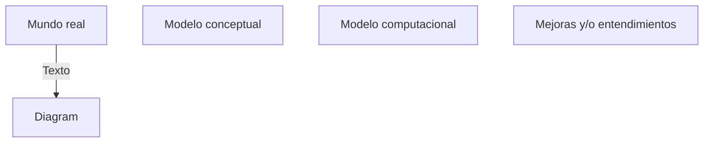

# 23/08 - Modelado Conceptual

## Modelado en simulación

Mundo Real (situación o problema) → Modelado Conceptual: Descripción de alto nivel del modelo a desarrollar. Muy importante para el ciclo de vida, requiere entender todos los otros pasos -(codificación)→ Modelo Computacional: -(experimentación)→ Mejoras y o Entendimientos: Derivadas de los resultados -(implantación de soluciones)→ Mundo Real.

## Modelo conceptual (MC)

Descripción (Representación simplificada del mundo) no basada en software del modelo de simulación computacional (Que será, es o ya ha sido desarrollado, pensado como independiente de una plataforma), que como mínimo incluye la identificación del objetivo, las entradas y salidas, el contenido del modelo y suposiciones y simplificaciones que se hayan introducido.

Suposición: “Supongo cosas que no se de la realidad”, o, cosas que podrían investigarse, pero no interesan o el hecho de investigarla gasta tiempo/recursos. Relacionada con el conocimiento del sistema, completo la falta de conocimiento sobre el mundo real. Ej. No existen los paros de colectivos, la frecuencia de los colectivos por la noche es menor.

Simplificación: Cosas que se hacen más fáciles por la dificultad de implementarlo en los plazos que tengo. Relacionada a la abstracción del modelo. *Cosas que SI entran en el modelo, pero se simplifican (no cosas que no entran en la abstracción).* 

## Artefactos del modelado conceptual

//fig. en el libro

### Descripción del sistema

Se relaciona con el dominio del problema. Es simplemente una desc. del problema, y, de alguna manera, de todos los elementos del mundo real (tal como son entendidos por el modelador) y tienen relación con mi problema.

Aquí se introducen las suposiciones

### Modelo conceptual

Explicado arriba.

Se relaciona con el dominio del problema, describiendo las partes de la desc. del sistema a ser incluidas en el modelo de simulación con su nivel de detalle.

El MC siempre tiene menos elementos de la desc. del sistema. *Es una abstracción de la misma.*

### Modelo de diseño

Diseño de los elementos y la lógica que se utilizara para el modelo computacional según del software elegido. Es independiente del software, aunque se comienza a tomar premisas del tipo de simulación (el “paradigma”) que quiero usar. Al tener un matiz de esto se tiene cierta impronta de las herramientas que se terminan utilizando.

### Modelo computacional

Representación de software de el MC, en una plataforma especifica.

## Requerimientos de los MC.

### No funcionales.

- **Validez:** Que el modelo produzca resultados suficientemente precisos para el propósito en cuestión.
- **Credibilidad:** Clientes o usuarios se fíen de los resultados que estoy otorgando.
- **Utilidad:** Que el modelo sea lo suficientemente *fácil de usar*, *flexible* (a la incorporación de cambios) que sea *visual* (sus elementos se pueden identificar y entender a la vista).
- **Viable:** Que sea posible construirlo dentro de las restricciones (tiempo, dinero, datos, …) impuestas al proyecto.

Estos requerimientos son **necesarios** y no son mutuamente excluyentes.

Pero lo más importante…

- **Simple:** Debe tener lo justo y necesario para responder a nuestro problema, mientras siga cumpliendo con todos los objetivos de M&S.
    - Pueden ser desarrollados más rápido.
    - Son más flexibles, requieren menos datos y corren más rapido.
    - Dan resultados fáciles de interpretar ya que su estructura es sencilla de comprender y comunicar.

Resulta de un trade-off entre la exactitud y la complejidad.

//fig.

La figura muestra que luego del punto **X**, por más que aumente mucho la complejidad, la exactitud no aumenta demasiado.

Además, un 100% de exactitud nunca puede ser alcanzado.

El 80% de la exactitud se obtiene con solo un 20% de exactitud.

¿Por qué cuando la complejidad llega al máximo, baja la exactitud? Se agregaron muchos elementos para los cuales no existe información para alimentarlos.

### Técnicas de simplificación (del modelo)

- Convertir algunas variables en constantes.
- Eliminar o combinar variables. Algunas de ellas pueden no ser tan relevantes.
- Suponer linealidad o promedios. En análisis de datos.
- Agregar suposiciones y restricciones más “fuertes”.
- Reducir los limites del sistemas.

## Actividades del modelado conceptual

**¿Qué tiene que hacer el modelador?**

- Desarrollar un entendimiento de la naturaleza del problema para proponer una solución adecuada.
- Determinar los objetivos de modelado.
- Diseñar el contenido del modelo conceptual.

## Objetivos de un MC

- **Factores experimentales y parámetros:** Se consideran las entradas. La información mínima necesaria como input del problema. Solo es necesario identificar los datos del sistema identificar los datos del sistema necesarios para parametrizar el modelo, ante un dato difícil/imposible de obtener, es conveniente hacer un rediseño y no considerarlo, estimarlo (si es importante) o considerarlo como factor experimental (para la próxima vez tenerlo)
    
    *Son aceptados en…*
    
- **Contenido del modelo:** Alcance y nivel de detalle. Debe garantizarme usar los fact. exp.
    
    *Produce…*
    
- **Resultados:** Salidas.
    
    Esos resultados *vuelven a vincularse* con los objetivos, para contrastarse con ellos y determinar el logro o el fracaso y sus razones.
    
    Resulta siendo un proceso **iterativo.**
    

### **Factor experimental (coloquial)**

Entrada con la que voy a poder generar distintos diseños del modelo. “Entrada con la que puedo experimentar”. En un super, la cantidad de cajas que hay es un fact. experimental. Si quiero mejorar el comportamiento, puedo proponer más cajas. Si me dicen que no es posible poner más cajas, es un parámetro.

**Diferencia con parámetro:** Puedo cambiar un factor experimental, no así un parámetro.

## Framework para el desarrollo de un MC

Es importante tener algún mecanismo para representar de forma clara el contenido del sistema

### 1: Desarrollar entendimiento

**Buscamos tener conocimiento al entender las estructura y la dinámica del sistema en relacion a un problema.**

- Estructura: Vista estática: Diag. de clases UML. Describe los elementos/componentes del sistema y sus relaciones de composición/asociación/agregación.
- Dinámica: Vista dinámica: Diag. de estado UML. Describe los estados del sistema en base al estado interno de sus elementos/componentes y la forma en la que se producen los cambios del estado.
- Conocimiento: ¿Qué pasa con lo que no logro conocer? Suposiciones. Enunciado en forma de texto que refiere a alguno de los elementos definidos en la estructura definida en la dinámica. *Ej: Todo pasajero atendido termina despachando su equipaje.*

### 2: Determinar los objetivos del modelado

**Delimitar el objetivo del modelo, cuales son las salidas requeridas para alcanzar el objetivo y cuales son las entradas básicas.**

- Objetivo: Definido en una sola oración, normalmente iniciada con un verbo. Ej.: Reducir el tiempo de despacho de equipaje de los pasajeros.
- Salidas: Todo lo que es interesante medir para luego poder probar, por esta razón deben ser muchas. Relacionadas con una propiedad de alguna de las entidades identificadas en la etapa anterior. **Ej.:** No solo el tiempo de estadía del equipaje, sino datos extra que permitan saber porque el tiempo de estadía es tan largo, por ejemplo el tiempo de atención, cantidad promedio de pasajeros atendidos, longitud promedio de la cola.
- Entradas: Elemento necesario para producir una mejora o un mejor entendimiento del mundo real, pudiendo referir a alguno de los elementos definidos
    - **Factor experimental:** Nueva def. Entrada que define un elemento que puede ser modificado para lograr un impacto en el funcionamiento del sistema.
        
        *Ej: Si hay 15 pasajeros en una cola, abrir otro mostrador. Cantidad mostradores abiertos en el turno noche (factor referido a una regla de negocio).*
        
    - **Parámetro:** Entrada que define un elemento fijo (fijo en el sentido de que no puedo modificarlo para experimentar con el, por más que pueda ser aleatorio o probabilistico) que configura el modelo de simulación a fin de que logre imitar el comportamiento requerido.
        
        Ej: Rate de llegada *(podríamos considerarlo como factor experimental si tenemos en cuenta los días como Navidad, Año Nuevo, días con promociones donde el rate de llegada es mayor)*.
        
    
    La diferencia esta dada por lo que el cliente nos dice que es posible modificar o no.
    
### 3: Diseñar el contenido del MC
    
    Buscamos determinar los componentes que formaran parte del modelo de simulación y la forma en la cual estos componentes deben ser incorporados.
    
    **Alcance** de los componentes**:** Alcance del modelo. Evaluar cada uno de los elementos de mi estructura según los objetivos que he puesto. Para cada elemento de mi estructura, decidir si lo incluyo/excluyo, en algunos casos esta decisión se debe argumentar usando entradas/salidas o por la inclusión de simplificaciones. Ej: Equipaje de mano. Lo excluimos por su falta de relevancia al problema. Empleado. Nunca se entro en el nivel de detalle como para definir cantidad de empleados, o definición de tipos de empleado.
    
    **Nivel de detalle:** Una vez que se incluyeron elementos, con que nivel de detalle se incluyen. Buscar propiedades de los elementos de forma tal que estas prop. estén alineadas con los objetivos. La inclusión estas propiedades también estarán debidamente justificadas.
    
### 4: Diagrama de flujo
    
    Tomar cada entidad o componente que fluye por el modelo (en este caso, el pasajero) y se arma un diagrama de flujo para mostrar como lo hace.