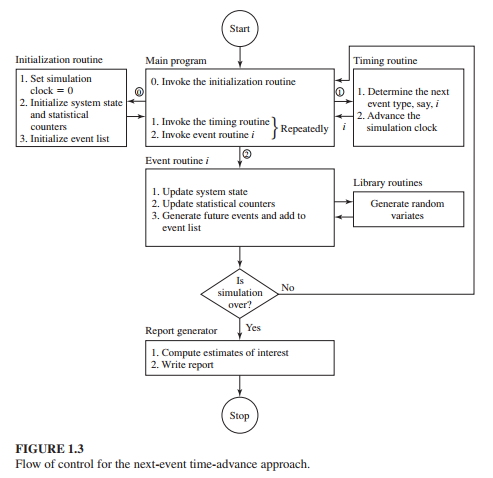

# DES

## Evolución temporal en DES

...

## Mecanismos de avance de tiempo

Lo que hacen los simuladores que implementan este tipo de paradigma...

+ Orientada al intervalo.
+ Orientada al evento.

### Orientada al intervalo

"Avancemos el tiempo de simulación siempre de a una unidad" Intervalos regulares en los que avanza el tiempo. Se determina en cada intervalo si debe ocurrir un evento.

Si en el intervalo que paso existió un evento, lo proceso ahora, en este.

En cada paso:

+ Mirar si en el intervalo previo se dieron eventos.
+ Si hay eventos, los ejecuta. Se ejecutan como si hubieran pasado en ese instante.
+ Se actualizan los estadisticos.
+ Avanza otro \delta t

Si hay muchos eventos en un intervalo, estos se ejecutan juntos, pero en el orden real en que sucedieron.

Si se dan en el exacto mismo momento, se hace un desempate con algun criterio (no se puede hacer concurrencia).

Se usa más en simulaciónes continuas.

### Orientado al evento

Es el que más se usa (incluido Simio).

"Intentar que el modelo se ejecute cuando se encuentra un evento"

El tiempo de simulación avanza el tiempo necesario para alcanzar el proximo evento cualquiera sea ese incremento.

Proximo evento = Evento más inminente.

+ Programación de eventos: El que vemos.
+ Interaccion de procesos.
+ Busqueda de acividades

### Ventajas y desventajas

Desventajas intervalo

Si los eventos estan muy distanciados respecto al t, proceso pasos que no necesito.

Estoy retrasando la ejecución de los eventos, que no es una representacion muy fidenigna de la realidad.

Es mucho más fiel al comportamiento del sistema.

No hay incrementos "sin sentido"

Contra: Tenemos que mantener siempre la lista de eventos mas inminentes, y es más complicado hacer esto en este metodo.

+ Intervalo, se hacen saltos y puede ser que no haya nada para ejecutar. En evento no.

## Componentes y Organización

¿Que debería tener el simulador para ejecutar un modelo DES?

+ Estado del sistema: Colección de variables de estado necesarias para describir al sistema en un punto en el tiempo. El modelo que estamos por ejecutar. Puede escribirse como una colección de entidades, o de variables de estado.
+ Reloj de simulacion: El unico objetivo es mantener el t en el que estoy actualmente.
+ Lista de eventos: Conjutno de eventos que se tienen que dar *a futuro*.
+ Contadores estadisticos: Variables que almacenan información estadistica referida al comportamiento del sistema. Los elementos que necesito para despues hacer un reporta. Todos los que se necesiten.
  + Nota normalmento no se usan promedios. Ejemplos para ascensor: Cantidad maxima de personas que se subieron, tiempo que estuvo funcionando.
  + Tienen que ser siempre variables de salida. *No* son metricas.
  + Deben ser lo más puras posibles. Tiempos, cantidades. Algo que se midio en un momento que interesa guardar.
+ Rutina de inicialización: 
+ Rutina de tiempo: Subporgrama que determina el proximo evento desde la lista de eventos, actualizando el reloj de simulación al instante cuando tiene lugar.
+ Rutina de evento: Subprograma que actualiza el estado del sistema cuando un tiepo particular de evento tiene lugar.
  + Cada evento tien su misma rutina.
+ Libreria de rutinas: Subprogramas usados para generar observaciones aleatorias desde las distr. de probabilidad asociadas al modelo.
  + Basicamente lo que hicimos en la unidad 2.
  + Valores de tiempo entre arribo, tiempo de procesamiento, ...
+ Generador de reportes: Se ejecuta cuando termina la simulación. Haciendo uso de los contadores estadisticos, calcula las metricas.
+ Programa principal: Coordina todos los otros elementos.

Lo unico que no forma parte explicita es la condición de terminación. Basada en el reloj de simulación o estado del sistema. Cantidad de entidades procesadas, tiempo de simulación...

## Practica

Meta: Un solo contador estadistico: Cantidad de entidades procesadas.
