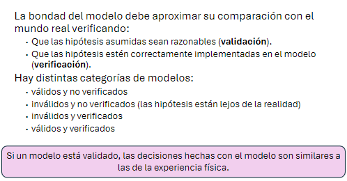

# Validación y Verificación

En el analisis de salidas de Simulación, el objetivo es estimar los parámetros de las distribuciones de salida.

## Importancia del análisis estadistico

+ Comprendiendo la variabilidad: Al analizar la distribución de los resultados (tiempo de vuelta, consumo de combustible, desgaste de los neumaticos), pueden obtener una imagen más precisa del rendimiento esperado del coche en diversas condiciones.
+ Identificando el punto óptimo: Un pequeño cambio en una variable de entrada, como la configuración del aleron delantero, puede tener un impacto significativo en el rendimiento general del coche. El analsis estadístico, a traves de técnicas como el diseño de experimentos, permite al equipo evaluar...
+ Validando el modelo con datos reales: El analsiis estadistico permite al equipo comparar los resultados de la simulación con datos de telemetría recopilados duranete las pruebas y las carreras.
+ Tomando decisiones estrategicas: Un modelo bien validado, combinado con un solido análisi estadistico, puede ayudar al equipo predecir el rendimiento del coche y de los competidores bajo diferentes escenarios, permitiendoles tomar decisiones más informadas y aumentar sus posibilidades de exito.

## Salidas de simulación

> Una salida de simulación es una estimación de la performance o desempeño de un sistema.

Las salidas de nuestro modelo son muestras de alguna distribución de probabilidad. Son variables aleatorias, ya que proveen de otras variables aleatorias (en la entrada o "dentro" del sistema).

*(ver ejemplo de diapositivas en campus)*

Es importante ir cambiando la semilla del generador de # aleatorios.

## Sistemas con final definido y no definido

Las salidas de simulación se deben analizar según criterios del sistema y del tipo de simulación.

+ Con final definido: Los eventos dejan de ocurrir naturalmente en un determinado momento. El estado final de un periodo no afecta al comienzo del siguiente período.
  + Un comercio o entidad que tiene horario de apertura y cierre (atención presencial).
+ Con final no definido: Los eventos que ocurren en el sistema no terminan y no hay un evento que indique el fin. La actividad del sistema en un período puede estar relacionada con la actividad en períodos anteriores.
  + Un aeropuerto donde siempre hay tráfico de aviones y pasajeros.

## Tipos de simulaciones con enfoque al análisis de salidas

+ Simulaciones terminantes: Los eventos dejan de ocurrir en determinado momento. El estado final de un período no debe afectar al comienzo del siguiente período. Ej.: La atención de un banco, el dictado de un curso.
+ Simulaciones no terminantes: Los eventos que ocurren en el sistema no terminan y no hay un evento que indique el fin. La simulación se corre hasta un período determinado por el estudio. Por ejemplo: El aeropuerto (se corre hasta un tiempo segun un criterio dado).
  + De ciclos de estado estacionario: Se detectan dos o más periodos definidos con distintos comportamientos. Ej.: Llamadas a un servicio de asistencia técnica, alta demanda de 8 a 20, y baja demanda de 20 a 8.
  + De parametros de estado estacionario (shifting steady-state): En cierto momento cambia un parametro de la simulación. Por ej.: Cambios de producción en el tipo de producto, en el número de trabajadores, o en la practica de operación, suponiendo que cada uno de estos aspectos afectan a las salidas de simulación.

## Verificar y Validar

**Verificar:** Comprobar que el programa de simulación, que la transformación del modelo de diseño y conceptual haya sido realizada correctamente hacia el modelo computacional.

**Validar:** Comrpobar que los resultados sean comparables con datos del sistema real. Asegurar que el modelo es suficientemente exacto para el propósito del estudio. Si el sistema no existe, o no tengo datos: Viendo sistemas similares, consultando a expertos, datos historicos...

## Tecnicas de verificacion

+ Corrección de errores: Correr varios valores de parametros y chequear salidas, para ver si estas cambian (o no) de manera razonable. Ej.: Cambiamos el tiempo de atención sin cambiar el tiempo entre arribos, y la longitud de cola promedio no cambia.
+ Correr por trazas: La traza es el estado del sistema en un tiempo dado de simulación. Cada vez que ocurre un evento se imprime una lista para poder seguirla a mano.
+ Disponer de un modelo simplificado para chequear: Ej.: Modelo de teoria de colas (como en TP).
+ Observar una animación de la salida del programa (Simio).
+ Escribir las salidas y comparar con datos historicos.
+ Usar un simulador en paralelo que ejecute el mismo modelo.

## Validación

+ Comprobar que los resultados sean comparables con datos del sistema real. No hace dalta una correspondencia 1 a 1 (asumo que debe ser a nivel de distribución de probabilidad).
+ En general las diferencias entre salidas deberían ser de menos del 20%

### Principios basicos

+ Una clara definición de las entidades y salidas o respuestas y  un buen entendimiento del sistema.
+ Entender y comprender las necesidades del cliente.
+ Consultar con "expertos" (especialistas y gerentes) y realizar análisis de sensibilidad (cómo impactan las variantes de los parámetros) para ayudar a determinar el nivel de detalle.
+ Seguir un nivel de detalle moderado y consistente con el tipo de datos disponible, teniendo en cuenta que es función del tiempo y dinero.
+ Si el número de factores es grande  se requiere un modelo analítico para identificar factores importantes.

