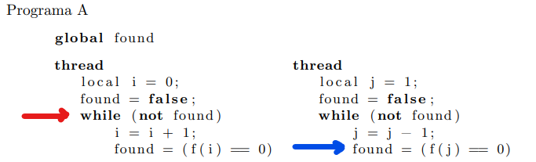

# Practica 1

## Ejercicio 3 

### Programa A

No es correcto. Si asumis que la raiz es el número entero positivo N, y la ejecución se encuentra así:

El valor de la flag es 1, y A esta apunto de salir del loop. B toma el control, B seteará el valor de la flag a 0 justo antes de que A pueda hacer el checkeo lógico que lo sacaría del while. Ambos programas entraran de nuevo al while y seguiran ejecutandose infinitamente ya que nunca van a volver a evaluar la función en N (considerando que exista una sola raiz entera real).

### Programa B

No es correcto. Mismo problema que el Programa A.

### Programa C

Parece ser correcto. La variable esta seteada en false antes de que cualquiera de los programas inicie ejecución, y solo es modificada cuando uno de los programas encuentre la raiz (solo uno puede encontrarla). Cuando un programa encuentre la raiz N, va a modificar la flag a True y va a salir eventualmente de la ejecución. El otro programa no va a encontrar la raiz, pero tampoco va a modificar nunca la flag, por lo que eventualmente se encontrará con la flag en true y saldrá de la ejecución.

## Ejercicio 4

+ a) No, el thread B puede ejecutarse en su totalidad, dejando n = 2 antes de que thread A comience su ejecución. Nunca va a entrar en el while y por ende nunca imprimir nada en pantalla.
+ b) Puede mostrarse una vez en la salida. Se daría en el caso en el que `n < 2` antes de checkear la condición de while y `n==2` cuando está dentro del while y antes de ejecutar `print(n)`. Luego de terminar la ejecución del while, la siguiente vez que se haga el checkeo lógico el programa saldrá del bucle y finalizará ejecución.
+ c) Podría imprimirse `1` indefinidas veces. Imaginar que `n==1` cuando se entra al bucle y el thread B finaliza forzadamente. Thread A no tiene la capacidad de asignar valores a `n` por lo que seguirá en bucle hasta que finalice de manera forzada.
+ d) La secuencia más corta es de 0, el caso descrito en el inciso a).

## Ejercicio 5

+ a) Si, el caso en que el thread A se ejecuta en su totalidad antes de que el thread B comience.
+ b) Si, existe un flujo de control en el que el que un thread toma el control y modifica la variable, justo antes de que revise la condición del while, el otro thread toma el control y se ejecuta hasta volver a asignar 0 a la variable, también devolviendo el control al otro thread antes de revisar su propia condición, y así indefinidamente. De esta manera, no solo el thread A no termina sino que ambos no terminan.

## Ejercicio 6

+ Puede ser...
  + 0: Por ejemplo, Thread B se ejecuta completo antes de que Thread A comience.
  + 1: Thread A se ejecuta hasta entrar al while, antes de modificar n. Thread B completa su ejecución, dejando la flag en true. Luego A asigna `n = 0+1`, luego ve que la flag está en true y termina su ejecución. n queda en 1.
+ Existe un flujo de ejecución en el que:
  + Thread A realiza un loop, dejando a n=1.
  + Luego Thread B realiza un loop, y como n=1 vuelve a entrar al loop.
  + Cada dos loops de A, B hace un loop, y así indefinidamente. De esta manera, thread B nunca "ve" a n en 0, siempre lo encuentra en 1.

## Ejercicio 7

No resuelve al exclusión mutua. 