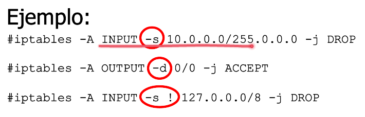
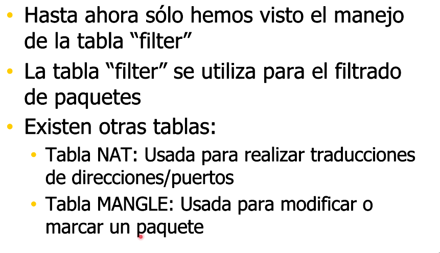
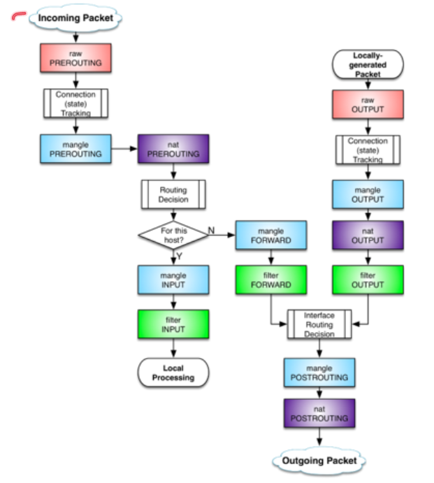

# Firewall y NAT

## Firewall

Controla el trafico entre dos redes, tipicamente entre nuestra net privada y el Internet.

Para que funcione, debe haber un punto de contacto.

## Tecnologías de Firewall

+ Filtrado de paquetes.
+ Traduccion de direcciones.
+ Servidores de conexion.
+ (me falto una).

### Filtrado de paquetes

En producción, se suele arrancar con denegar por defecto e ir autorizando de a poco.

Hay que ir registrando el trafico.

### IP Tables

REJECT avisa al origen que el paquete fue bloqueado. Generalmente para no revelar la ubicación del firewall.

En los routers, si el paquete no es para el mismo, o sale de el mismo, se procesa solo con la cadena de FORWARD.

Se pueden agregar negaciones a las reglas de  IP Tables con `!`

Se puede filtrar por MAC.

`--state RELATED`: Estado especifico para trafico que es no orientado a la conexión. Representa a paquetes que estan relacionados con una conexión aunque no sean parte de ella. Puede servir para ICMP, consultas DNS.

## NAT

Con IPTables se puede hacer traducción de direcciones.

Esta estandarizado.

Cambia la dirección de origen al paquete. Se usa para redes con direccionamiento privado. Cuando vuelve la respuesta, el router hace la traducción inversa.

Desventajas:

+ Traduccion introduce latencia, aunque minima. No solo la traducción pero el mantenimiento de la tabla, la busqueda en la tabla...
+ Perdida de conectividad (trace) extremo a extremo. El host de destino no sabe exactamente quien es el otro extremo. Ej.: Trafico voz IP.
+ Algunas aplicaciones no funcionan con NAT habilitado.

### Tipos de NAT

+ Source NAT: Deberiamos tener una IP Publica para cada host. Por eso generalmente no se usa, salvo quiza para servidores.
+ Destination NAT.
+ PAT (Masquerade): Ademas de hacer la traducción hacemos una traducción de puertos de transport layer.
  + Sirve para resolver conflictos donde muchos hosts comparten una IP Publica.
  + Asigna puertos distintos a cada host.

### Configuración de NAT en IP Tables

+ Podes priorizar trafico con MANGLE.
+ -j MASQUERADE le asigna el source automaticamente la IP que está asignada a la interfaz que se especifica.
+ Cadena de POSTROUTING se hace para source NAT.
+ Cadena de PREROUTING se hace para destination NAT.

### Resumen de procesamiento IP Tables

EC2 bloquean todo el trafico entrante cuyo origen no es ellas mismas. Debemos desactivar esta medida de seguridad. Es algo especifico de AWS.

Linux en su mayoria de distros viene preconfigurado para no trabajar como router. Ignora trafico que no esta destinado a si mismo.

Despues del paso 9 checkear conectividad.

## Consumir servicios dentro de una red interna

Cuando tenemos una IP publica, queremos desde afuera entrar a un servidor que esta dentro de nuestra IP interna.

Digamos que llega un paquete requiriendo un servicio HTTP. El router de "borde" de nuestra red (o un proxy, quien sea que tenga asignada la IP publica) podría hacer DNAT, y cambiarle la IP a la IP privada del servidor.

> **(!) Aclaración importante**
> 
> + Cuando cargas una regla de DNAT para publicar un servicio, no hace falta una regla de SNAT para que la respuesta lleve la IP publica, IPTables ya tiene cargada la asociación y lo hace solo
> + Recordar que cuando llega la solicitud al bastión, ya no tiene la IP pública, tiene la IP interna del bastión.