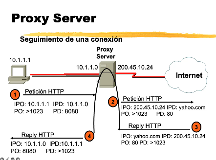

# Proxy Server

Servicio de capa de Aplicación. Tiene bastante costo de performance al tener que desencapsular todo lo que viene de las capas inferiores, ademas del analisis que hace a nivel de capa de Aplicación.

+ Recibe conexiones de clientes *internos*.
+ Normalmente se usa en una red LAN para poder conectar los hosts internos de una red hacia internet sin que navegen "directamente". *(Particularmente Proxy HTTP) Ningun host dentro de la LAN tiene derecho a navegar sin pasar por el Proxy Server*.
+ Puede:
  + Filtrar contenido segun usuario, tiempo del día.
  + Registrar tráfico.
  + Cachear información como páginas web para ahorrar ancho de banda.

¿Como es diferente de NAT? NAT y PAT trabajan a nivel de Capa 3 y 4 respectivamente. Proxy trabaja a nivel de capa de Aplicación, pudiendo ver contenido de paquetes, URLs...

Proxy más utilizado: Squid. Es un paquete sobre Linux. Aunque se esta dejando de usar en favor de equipos como FortiNET, que te da mismas prestaciones sin necesidad de tener un servicio en el medio, sin cambiar configuración de navegador, configuración de proxy...

## Ejemplo de funcionamiento

