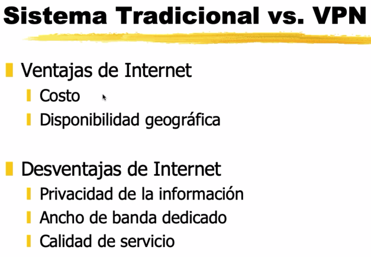

# VPN

Conexión segura "tunelizada" entre dos LANs corporativas, a traves de Internet. Encriptado a nivel de capa 3.

Desventaja: Envío por internet -> No conocemos los routers y el throughput. No podemos asegurar ancho de banda.

Otra solución: Enlace dedicado. Mucho más caro por supuesto. Si ademas queremos agregar seguridad (el enlace termina en un carrier de telefonía igual).

Que cantidad de throughput permite mi placa de red? El equipo es eficiente en su encriptación?

De diapositiva:

## Ventajas y limitaciones de VPN

### Ventajas

+ Bajo costo.
+ Baja inversión inicial. Ej.: Un MikroTik puede levantar IPSec.
+ Escalabilidad.
+ Seguridad integrada.

### Limitaciones

+ Sobrecarga de cliente.
+ Complejidad del tráfico.
+ Dependencia de medios no fiables. Por ahi se tienen dos tuneles para tener failover.